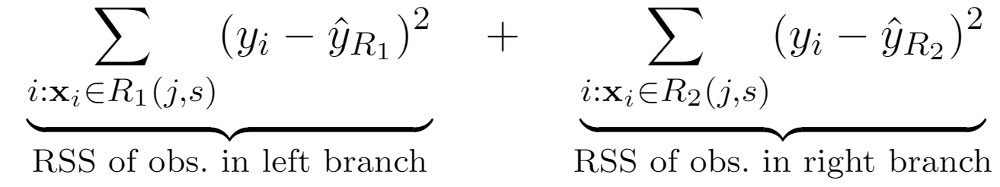
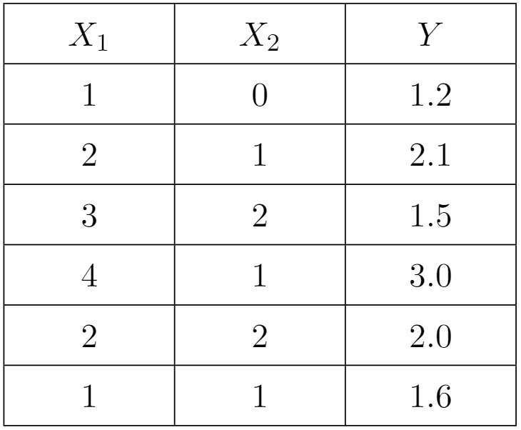

# Regression Trees

-   The tree will search for all combination of predictors and cutoff value to decide the best split

-   In Regression tree, the best split is the split that minimizes

{width="80%"}

-   $\hat{y}_{R_1}$ and $\hat{y}_{R_2}$are the means of the responses falling in to the left branch and right branch, respectively.

# Example

{width="50%"}

Using the RSS to decide the best split among

-   Split 1: Region 1 $X_1 < 4$, Region 2 $X_1 \geq 4$

-   Split 2: Region 1 $X_2 < 2$, Region 2 $X_2 \geq 2$

#

# 

Suppose that your regression tree contain only one split which is the best split in the previous question. Calculate the $R^2$ of this regression tree on the training data. 

#

#

Use your regression tree to predict the $y$ for the below testing data.  Calculate the $R^2$ of the tree on the testing data.

| $x_1$    | $x_2$ | $y$|
|:-------------|:----------------|:----------------|
| 3   | 1           |3.0|
| 1   | 5           |3.6|
| 5   | 1           |4.0|
| 5   | 2           |3.9|

# 

