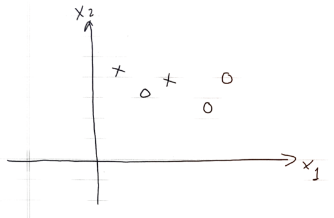

```{r global_options, include=FALSE}
knitr::opts_chunk$set(fig.width=12, fig.height=8, fig.path='Figs/',
                      echo=FALSE, warning=FALSE, message=FALSE)
```

This exam has two components: *SAS Component* and *Calculation Component.*  

-------

## I. SAS Components

_**What to do:**_  Using Zoom or another software Make a tutorial video for beginners to address the follows. Submit the video link to Canvas.


_**Instruction**_:  A similar video solution to this assignment on the titanic dataset can be found in the links below.  The videos walk through all the questions of this assignments.

https://bryant.hosted.panopto.com/Panopto/Pages/Viewer.aspx?id=2252e187-1503-4a2b-b6c2-adb40101ab39

-------

1. Download and Import to SAS Miner the `Breast Cancer Wisconsin (Diagnostic) Data Set` at [this link](breast_cancer.csv). 

2. Reject all the `text` variables.  Set `diagnosis` as the binary target. 

3. Split the data 70:30:0 for Training: Validation: Test. Create the following decision trees.  

    - a decision tree used `Gini Index` for splitting (Nominal Target Criterion)
  
    - a decision tree used `Entropy` for splitting (Nominal Target Criterion)
  
    - a decision tree used Chi-squared test for splitting (Nominal Target Criterion)
  
    - a decision tree with 4 leaves. 

4. Compare the trees in terms of misclassification rate and ROC-Index. 

5. Show the confusion matrix (classification table) of the `Entropy` tree and compute its F1-Score on validation data.

6. What is the best tree in term of misclassification.  In that tree, what is the most important variables? 

7. How many leaves that tree in 6. have? Explain why the tree ended up with that number of leaves. (i.e., explain the `Subtree Assessment Plot`).


-------

## II. Calculation Components

_**Instruction**_:  The this component has two problems.  You can scan your answers and submit it to Canvas.  You can also type your answers and submit the documents to Canvas.  For Problem 1, a similar problem can be found at the example at the class slides ([Link](fa21_classification_tree2_original.pdf)). For Problem 2, a link to a similar problem is provided at the problem. 

-------

#### Problem 1

Decide the best vertical first split of decision tree for the following dataset.  Impurity can be measured by entropy or Gini-Index. A similar problem can be found at the example at the class slides ([Link](fa21_classification_tree2_original.pdf)).

<center>

</center>

#### Problem 2

A similar problem and solution can be found here: [Link](Exam1_sol.html)

```{r, echo = FALSE}
library(tidyverse)
ip = function(n0, n1){
  p0 = n0/(n0+n1)
  return(1-p0^2-(1-p0)^2)}

ig = function(a0, a1, b0, b1){
  k = (b0+b1)/(a0+a1)
  return(ip(a0, a1) - k*ip(b0,b1)-(1-k)*ip(a0-b0, a1-b1))}

igg = function(df, v, s)
# df = Data
# v = Index of the Variable to split
# s = Value the variable split at 
  
{
  #set the variable (x1) and the value it splits at(x1==1)
  s1 = table(df[df[,v]==s,]$target)
  tt = table(df$target)
  #calculate the impurity gain of the split
  ig1 = ig(tt[1],tt[2],s1[1],s1[2])
  
  return(ig1)
  
}

Class     =c(1,1,1,1,1,1,1,3,3,2,3,2,2,3,2,3,1,2,1,2)
Sex     =  c(0,0,0,1,0,0,0,1,0,1,0,1,1,1,1,0,0,0,1,1)
target =   c(1,1,1,1,1,1,1,1,1,0,1,0,0,0,0,0,0,0,0,0)
d = as_tibble(cbind(Class, Sex, target))


```

- Given the **training** data.  

<center>
```{r, echo = FALSE}
names(d) = c("Class", "Sex", "Survived")
knitr::kable(d)
```
</center>

Using Gini Index as the measure for impurity to:

1. Grow the **maximum tree** with three leaves (a stopping rule!) on the data.  Draw the (diagram of) tree. 
2. Find the misclassification rate on training data of the maximal tree
3. Draw all the possible **subtrees**
4. Validate the maximal tree and all the subtrees on the following data to select the **optimal tree**. Note: if the chance of Survived is 1/2, predict `Survived`

<center>
```{r, echo = FALSE}
knitr::kable(as_tibble(data.frame(Class=c(1,1,3,2), Sex =c(0,1,1,0), Survived =c(1,1,0,0))))
```
</center>


