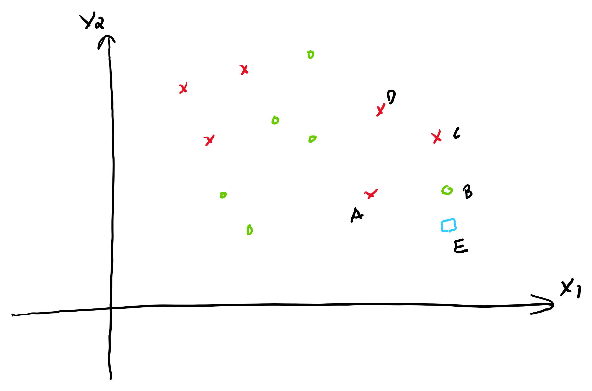

```{r global_options, include=FALSE}
knitr::opts_chunk$set(fig.width=12, fig.height=8, fig.path='Figs/',
                      echo=FALSE, warning=FALSE, message=FALSE)
```


Similar problems and solutions to Problem 1, 2 and 3 can be found [here](sol.html). Take photos of your answers and submit it to Canvas.  

### Problem 1. 
Given the data.

<center>
|    |   Age | Sex   |   Survived |
|----|-------|-------|------------|
| A  |    27 | M     |          0 |
| B  |    30 | F     |          1 |
| C  |    80 | F     |          1 |
| D  |    50 | M     |          0 |
| E  |    60 | F     |          0 |
| F  |    70 | F     |          1 |
</center>

a. Let G be a female of 55 years old.  Use 1NN to predict whether G is survived (`Survived =1`) or not (`Survived = 0`). Does the prediction change if used 3NN?

b. Given the following data, use 1NN and 3NN to predict the salary for G (a female of 55 years old). 

|    |   Age | Sex   |   Salary (k) |
|----|-------|-------|------------|
| A  |    27 | M     |         80 |
| B  |    30 | F     |         70 |
| C  |    80 | F     |         90 |
| D  |    50 | M     |         60 |
| E  |    60 | F     |         10 |
| F  |    70 | F     |        100 |

### Problem 2.  
Given the data. Consider $x$ as 1 and $o$ as 0.



With EB = 1.4, EA = 3, EC = 3, ED = 4, 

a. Use the **uniform weights** to calculate the predicted probability and the prediction of **3NN** for E.

b. Use the **distance weights** to calculate the predicted probability and the prediction of **3NN** for E. 

b. Use the **distance weights** to calculate the predicted probability and the prediction of **4NN** for E. 


### Problem 3

Given the utility matrix

|        | Item 1 | Item 2 | Item 3 | Item 4 | Item 5 |
|--------|--------|--------|--------|--------|--------|
| Alice  | 5      | 3      | 3      | 4      |        |
| User 1 | 3      | 1      | 2      | 3      | 3      |
| User 2 | 2      | 3      | 4      | 3      | 5      |
| User 3 | 3      | 3      | 1      | 4      | 4      |
| User 4 | 1      | 5      | 5      | 4      | 2      |

Should we recommend Item 5 to Alice?  Calculate her estimated rating on Item 5 to answer the question. Recommend the item if Alice's rating is 4 or above. 

a. Use user-based KNN, with $k=2$ and Manhantan distance. 

b. Use item-based KNN, with $k=3$ and cosine similarity. 