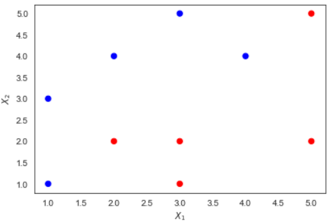
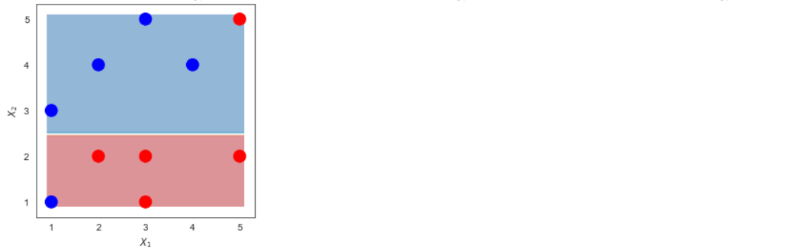
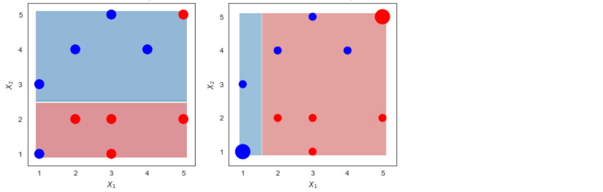
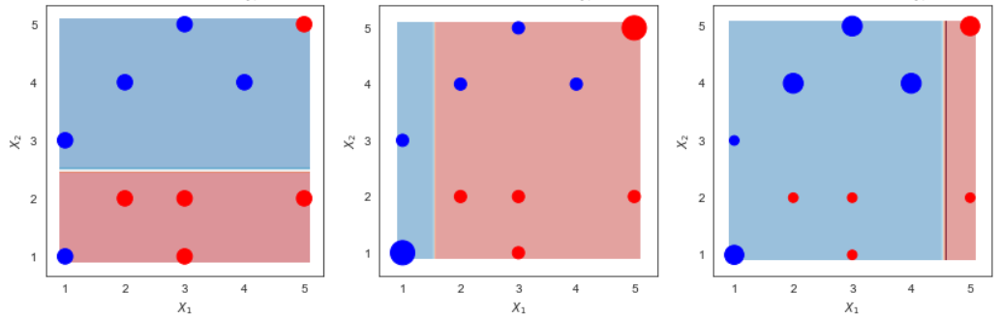
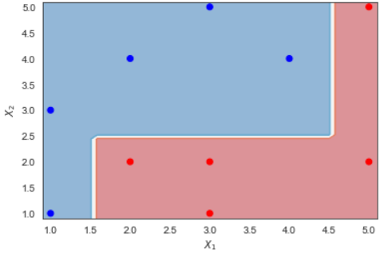
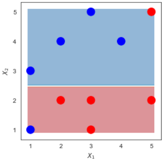
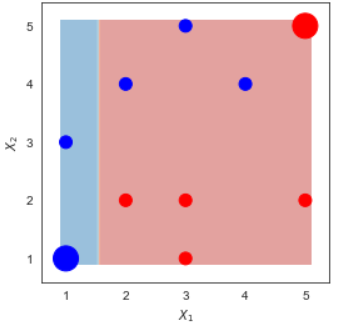
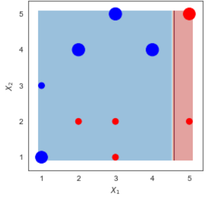

<style>

.remark-slide-content {
  background-color: #FFFFFF;
  border-top: 80px solid #F9C389;
  font-size: 20px;
  font-weight: 300;
  line-height: 1.5;
  padding: 1em 2em 1em 2em
}

.inverse {
  background-color: #696767;
  border-top: 80px solid #696767;
  text-shadow: none;
  background-image: url(https://github.com/goodekat/presentations/blob/master/2019-isugg-gganimate-spooky/figures/spider.png?raw=true);
	background-position: 50% 75%;
  background-size: 150px;
}

.your-turn{
  background-color: #8C7E95;
  border-top: 80px solid #F9C389;
  text-shadow: none;
  background-image: url(https://github.com/goodekat/presentations/blob/master/2019-isugg-gganimate-spooky/figures/spider.png?raw=true);
	background-position: 95% 90%;
  background-size: 75px;
}

.title-slide {
  background-color: #F9C389;
  border-top: 80px solid #F9C389;
  background-image: none;
}

.title-slide > h1  {
  color: #111111;
  font-size: 40px;
  text-shadow: none;
  font-weight: 400;
  text-align: left;
  margin-left: 15px;
  padding-top: 80px;
}
.title-slide > h2  {
  margin-top: -25px;
  padding-bottom: -20px;
  color: #111111;
  text-shadow: none;
  font-weight: 300;
  font-size: 35px;
  text-align: left;
  margin-left: 15px;
}
.title-slide > h3  {
  color: #111111;
  text-shadow: none;
  font-weight: 300;
  font-size: 25px;
  text-align: left;
  margin-left: 15px;
  margin-bottom: -30px;
}

</style>

```{css, echo=FALSE}
.left-code {
  color: #777;
  width: 40%;
  height: 92%;
  float: left;
}
.right-plot {
  width: 59%;
  float: right;
  padding-left: 1%;
}
```

# Adaboost


---
# Adaboost


---
# Adaboost, Clearly Explained


- Demonstration by StatQuest
- [Link](https://www.youtube.com/watch?v=LsK-xG1cLYA)

---
# Calculation Example

Data


.pull-left[

| $x_1$ | $x_2$ | y  |
|----|----|----|
| 1  | 1  | 1  |
| 1  | 3  | 1  |
| 2  | 2  | -1 |
| 2  | 4  | 1  |
| 3  | 1  | -1 |
| 3  | 2  | -1 |
| 3  | 5  | 1  |
| 4  | 4  | 1  |
| 5  | 2  | -1 |
| 5  | 5  | -1 |

]

.pull-right[

]

---
# Calculation Example

Data


.pull-left[

| $x_1$ | $x_2$ | y  |
|----|----|----|
| 1  | 1  | 1  |
| 1  | 3  | 1  |
| 2  | 2  | -1 |
| 2  | 4  | 1  |
| 3  | 1  | -1 |
| 3  | 2  | -1 |
| 3  | 5  | 1  |
| 4  | 4  | 1  |
| 5  | 2  | -1 |
| 5  | 5  | -1 |

]

.pull-right[
```{r, echo = FALSE}

```
]


---
# Adaboost in a nutshell

---
# Make Stump 1

```{r, echo = FALSE}

```

---
# Make Stump 2

```{r, echo = FALSE}

```

---
# Make Stump 3

```{r, echo = FALSE}

```

---
# Combine the Stumps

```{r, echo = FALSE, fig.height=1}

```

---
class: inverse, center, middle

# Detail Calculation


---
# Make the first stump

.pull-left[

]

.pull-right[

|Row |   x1 |   x2 |   y |  
|----|------|------|-----|
|  0 |    1 |    1 |   1 |        
|  1 |    1 |    3 |   1 |        
|  2 |    2 |    2 |  -1 |        
|  3 |    2 |    4 |   1 |        
|  4 |    3 |    1 |  -1 |        
|  5 |    3 |    2 |  -1 |        
|  6 |    3 |    5 |   1 |        
|  7 |    4 |    4 |   1 |        
|  8 |    5 |    2 |  -1 |        
|  9 |    5 |    5 |  -1 |        
 
]


---
# Make the first stump

.pull-left[

- Assign weights for each row
- Every row has the same weight in the first step


]

.pull-right[

|Row |   x1 |   x2 |   y |  
|----|------|------|-----|
|  0 |    1 |    1 |   1 |        
|  1 |    1 |    3 |   1 |        
|  2 |    2 |    2 |  -1 |        
|  3 |    2 |    4 |   1 |        
|  4 |    3 |    1 |  -1 |        
|  5 |    3 |    2 |  -1 |        
|  6 |    3 |    5 |   1 |        
|  7 |    4 |    4 |   1 |        
|  8 |    5 |    2 |  -1 |        
|  9 |    5 |    5 |  -1 |        
 
]


---
# Make the first stump


.pull-left[

- Assign weights for each row

- Every row has the same weight in the first step


]

.pull-right[

|Row |   x1 |   x2 |   y |  Weight 1  |
|----|------|------|-----|------------|
|  0 |    1 |    1 |   1 |        0.1 |
|  1 |    1 |    3 |   1 |        0.1 |
|  2 |    2 |    2 |  -1 |        0.1 |
|  3 |    2 |    4 |   1 |        0.1 |
|  4 |    3 |    1 |  -1 |        0.1 |
|  5 |    3 |    2 |  -1 |        0.1 |
|  6 |    3 |    5 |   1 |        0.1 |
|  7 |    4 |    4 |   1 |        0.1 |
|  8 |    5 |    2 |  -1 |        0.1 |
|  9 |    5 |    5 |  -1 |        0.1 |
 
]


---
# Make the first stump


.pull-left[

- Use Weighted Gini-Index to calculate the children entropy of all candidate splits


]

.pull-right[

|Row |   x1 |   x2 |   y |  Weight 1  |
|----|------|------|-----|------------|
|  0 |    1 |    1 |   1 |        0.1 |
|  1 |    1 |    3 |   1 |        0.1 |
|  2 |    2 |    2 |  -1 |        0.1 |
|  3 |    2 |    4 |   1 |        0.1 |
|  4 |    3 |    1 |  -1 |        0.1 |
|  5 |    3 |    2 |  -1 |        0.1 |
|  6 |    3 |    5 |   1 |        0.1 |
|  7 |    4 |    4 |   1 |        0.1 |
|  8 |    5 |    2 |  -1 |        0.1 |
|  9 |    5 |    5 |  -1 |        0.1 |
 
]


---
# Make the first stump


.pull-left[

- Use Weighted Gini-Index to calculate the children entropy of all candidate splits

- The split with the lowest children impurity is the best split

]

.pull-right[

|Row |   x1 |   x2 |   y |  Weight 1  |
|----|------|------|-----|------------|
|  0 |    1 |    1 |   1 |        0.1 |
|  1 |    1 |    3 |   1 |        0.1 |
|  2 |    2 |    2 |  -1 |        0.1 |
|  3 |    2 |    4 |   1 |        0.1 |
|  4 |    3 |    1 |  -1 |        0.1 |
|  5 |    3 |    2 |  -1 |        0.1 |
|  6 |    3 |    5 |   1 |        0.1 |
|  7 |    4 |    4 |   1 |        0.1 |
|  8 |    5 |    2 |  -1 |        0.1 |
|  9 |    5 |    5 |  -1 |        0.1 |
 
]

---
# Make the first stump


.pull-left[

- Use Weighted Gini-Index to calculate the children entropy of all candidate splits

- The split with the lowest children impurity is the best split

- **NOTE**: You are not required to make the stump. So the stump will be given to you!
]

.pull-right[

|Row |   x1 |   x2 |   y |  Weight 1  |
|----|------|------|-----|------------|
|  0 |    1 |    1 |   1 |        0.1 |
|  1 |    1 |    3 |   1 |        0.1 |
|  2 |    2 |    2 |  -1 |        0.1 |
|  3 |    2 |    4 |   1 |        0.1 |
|  4 |    3 |    1 |  -1 |        0.1 |
|  5 |    3 |    2 |  -1 |        0.1 |
|  6 |    3 |    5 |   1 |        0.1 |
|  7 |    4 |    4 |   1 |        0.1 |
|  8 |    5 |    2 |  -1 |        0.1 |
|  9 |    5 |    5 |  -1 |        0.1 |
 
]


---
# Make the first stump

.pull-left[

- Use Weighted Gini-Index to calculate the children entropy of all candidate splits

- The split with the lowest children impurity is the best split

- **NOTE**: You are not required to make the stump. So the stump will be given to you!

- Here is the first stump
]

.pull-right[
```{r, echo = FALSE}

```
]

---
# Make the first stump

.pull-left[

- **Stump 1**: $I(x_2>2.5)$

]

.pull-right[
```{r, echo = FALSE}

```
]

---
# Prediction of Stump 1

.pull-left[

- **Stump 1**: $$I(x_2>2.5)$$

- If $x_2 > 2.5$, predicts $y=1$. 

- Otherwise, predicts $y=-1$

]

.pull-right[
| Row | x1 | x2 | y  | Stump 1 Predicts |
|-----|----|----|----|------------------|
| 0   | 1  | 1  | 1  | -1               |
| 1   | 1  | 3  | 1  | 1                |
| 2   | 2  | 2  | -1 | -1               |
| 3   | 2  | 4  | 1  | 1                |
| 4   | 3  | 1  | -1 | -1               |
| 5   | 3  | 2  | -1 | -1               |
| 6   | 3  | 5  | 1  | 1                |
| 7   | 4  | 4  | 1  | 1                |
| 8   | 5  | 2  | -1 | -1               |
| 9   | 5  | 5  | -1 | 1                |
]

---
# Error of the first stump

|Row | x1 | x2 | y  | Stump 1 Predicts | Weight 1 |
|---|----|----|----|-------------------------|-----------------|
| 0 | 1  | 1  | 1  | -1                      | 0.1             |<-
| 1 | 1  | 3  | 1  | 1                       | 0.1             |
| 2 | 2  | 2  | -1 | -1                      | 0.1             |
| 3 | 2  | 4  | 1  | 1                       | 0.1             |
| 4 | 3  | 1  | -1 | -1                      | 0.1             |
| 5 | 3  | 2  | -1 | -1                      | 0.1             |
| 6 | 3  | 5  | 1  | 1                       | 0.1             |
| 7 | 4  | 4  | 1  | 1                       | 0.1             |
| 8 | 5  | 2  | -1 | -1                      | 0.1             |
| 9 | 5  | 5  | -1 | 1                       | 0.1             |<-

---
# Error of the first stump

.pull-left[

- Stump 1 has 2 misclassifications at row 0 and 9 (The predictions are NOT the same as the $y$ values). The total weights of these rows are: $$\epsilon_1 = 0.1 + 0.1 = 0.2$$ 
]

.pull-right[
|Row | x1 | x2 | y  | Stump 1 Predicts | Weight 1 |
|---|----|----|----|-------------------------|-----------------|
| 0 | 1  | 1  | 1  | -1                      | 0.1             |<-
| 1 | 1  | 3  | 1  | 1                       | 0.1             |
| 2 | 2  | 2  | -1 | -1                      | 0.1             |
| 3 | 2  | 4  | 1  | 1                       | 0.1             |
| 4 | 3  | 1  | -1 | -1                      | 0.1             |
| 5 | 3  | 2  | -1 | -1                      | 0.1             |
| 6 | 3  | 5  | 1  | 1                       | 0.1             |
| 7 | 4  | 4  | 1  | 1                       | 0.1             |
| 8 | 5  | 2  | -1 | -1                      | 0.1             |
| 9 | 5  | 5  | -1 | 1                       | 0.1             |<-
]

---
# Voting Power of the first Stump

.pull-left[

- Stump 1 has 2 misclassifications at row 0 and 9 (The predictions are NOT the same as the $y$ values). The total weights of these rows are: $$\epsilon_1 = 0.1 + 0.1 = 0.2$$ 

- Voting Power: (L is the learning rate. $L = 1$ in this example 1)

$$\alpha_{1} = L \cdot \frac{1}{2} \cdot \ln(\frac{1-\epsilon_{1}}{\epsilon_{1}}) = 0.693$$
]

.pull-right[
|Row | x1 | x2 | y  | Stump 1 Predicts | Weight 1 |
|---|----|----|----|-------------------------|-----------------|
| 0 | 1  | 1  | 1  | -1                      | 0.1             |<-
| 1 | 1  | 3  | 1  | 1                       | 0.1             |
| 2 | 2  | 2  | -1 | -1                      | 0.1             |
| 3 | 2  | 4  | 1  | 1                       | 0.1             |
| 4 | 3  | 1  | -1 | -1                      | 0.1             |
| 5 | 3  | 2  | -1 | -1                      | 0.1             |
| 6 | 3  | 5  | 1  | 1                       | 0.1             |
| 7 | 4  | 4  | 1  | 1                       | 0.1             |
| 8 | 5  | 2  | -1 | -1                      | 0.1             |
| 9 | 5  | 5  | -1 | 1                       | 0.1             |<-
]

---
# Calculating the new weights

.pull-left[

- For misclassified rows 0 and 9: 

$$w_{new} =   w_{old} \cdot e^{\alpha}  = 0.1\cdot e^{0.693}= 0.2$$
- For the correctly classified rows:  

$$w_{new} =  w_{old} \cdot e^{-\alpha} = 0.1\cdot e^{-0.693} = .05$$
]

.pull-right[

|Row | x1 | x2 | y  | Stump 1 Predicts | Weight 1 |
|---|----|----|----|-------------------------|-----------------|
| 0 | 1  | 1  | 1  | -1                      | 0.1             |<-
| 1 | 1  | 3  | 1  | 1                       | 0.1             |
| 2 | 2  | 2  | -1 | -1                      | 0.1             |
| 3 | 2  | 4  | 1  | 1                       | 0.1             |
| 4 | 3  | 1  | -1 | -1                      | 0.1             |
| 5 | 3  | 2  | -1 | -1                      | 0.1             |
| 6 | 3  | 5  | 1  | 1                       | 0.1             |
| 7 | 4  | 4  | 1  | 1                       | 0.1             |
| 8 | 5  | 2  | -1 | -1                      | 0.1             |
| 9 | 5  | 5  | -1 | 1                       | 0.1             |<-

]


---
# Calculating the new weights

.pull-left[

- For misclassified rows 0 and 9: 

$$w_{new} =   w_{old} \cdot e^{\alpha}  = 0.1\cdot e^{0.693}= 0.2$$
- For the correctly classified rows:  

$$w_{new} =  w_{old} \cdot e^{-\alpha} = 0.1\cdot e^{-0.693} = .05$$
]

.pull-right[

| Row | x1 | x2 | y  | Stump 1 Predicts | Weight 1 | Weight 2 |
|-----|----|----|----|------------------|----------|----------|
| 0   | 1  | 1  | 1  | -1               | 0.1      | 0.2      |
| 1   | 1  | 3  | 1  | 1                | 0.1      | 0.05     |
| 2   | 2  | 2  | -1 | -1               | 0.1      | 0.05     |
| 3   | 2  | 4  | 1  | 1                | 0.1      | 0.05     |
| 4   | 3  | 1  | -1 | -1               | 0.1      | 0.05     |
| 5   | 3  | 2  | -1 | -1               | 0.1      | 0.05     |
| 6   | 3  | 5  | 1  | 1                | 0.1      | 0.05     |
| 7   | 4  | 4  | 1  | 1                | 0.1      | 0.05     |
| 8   | 5  | 2  | -1 | -1               | 0.1      | 0.05     |
| 9   | 5  | 5  | -1 | 1                | 0.1      | 0.2      |

]


---
# Calculating the new weights

.pull-left[

- For misclassified rows 0 and 9: 

$$w_{new} =   w_{old} \cdot e^{\alpha}  = 0.1\cdot e^{0.693}= 0.2$$
- For the correctly classified rows:  

$$w_{new} =  w_{old} \cdot e^{-\alpha} = 0.1\cdot e^{-0.693} = .05$$
- Notice how the weights increase for misclassified rows and decrease otherwise. 

]

.pull-right[

| Row | x1 | x2 | y  | Stump 1 Predicts | Weight 1 | Weight 2 |
|-----|----|----|----|------------------|----------|----------|
| 0   | 1  | 1  | 1  | -1               | 0.1      | 0.2      |
| 1   | 1  | 3  | 1  | 1                | 0.1      | 0.05     |
| 2   | 2  | 2  | -1 | -1               | 0.1      | 0.05     |
| 3   | 2  | 4  | 1  | 1                | 0.1      | 0.05     |
| 4   | 3  | 1  | -1 | -1               | 0.1      | 0.05     |
| 5   | 3  | 2  | -1 | -1               | 0.1      | 0.05     |
| 6   | 3  | 5  | 1  | 1                | 0.1      | 0.05     |
| 7   | 4  | 4  | 1  | 1                | 0.1      | 0.05     |
| 8   | 5  | 2  | -1 | -1               | 0.1      | 0.05     |
| 9   | 5  | 5  | -1 | 1                | 0.1      | 0.2      |

]

---
# Calculating the new weights

.pull-left[

- The total weights has to be 1. We divide the weights by the total $(.2*2+.05*8 = .8)$ to achieve this. 

]

.pull-right[

| Row | x1 | x2 | y  | Stump 1 Predicts | Weight 1 | Weight 2 |
|-----|----|----|----|------------------|----------|----------|
| 0   | 1  | 1  | 1  | -1               | 0.1      | 0.2      |
| 1   | 1  | 3  | 1  | 1                | 0.1      | 0.05     |
| 2   | 2  | 2  | -1 | -1               | 0.1      | 0.05     |
| 3   | 2  | 4  | 1  | 1                | 0.1      | 0.05     |
| 4   | 3  | 1  | -1 | -1               | 0.1      | 0.05     |
| 5   | 3  | 2  | -1 | -1               | 0.1      | 0.05     |
| 6   | 3  | 5  | 1  | 1                | 0.1      | 0.05     |
| 7   | 4  | 4  | 1  | 1                | 0.1      | 0.05     |
| 8   | 5  | 2  | -1 | -1               | 0.1      | 0.05     |
| 9   | 5  | 5  | -1 | 1                | 0.1      | 0.2      |

]

---
# Calculating the new weights

.pull-left[

- The total weights has to be 1. We divide the weights by the total $(.2*2+.05*8 = .8)$ to achieve this. 

- Divide Weight 2 by 0.8

]

.pull-right[

| Row | x1 | x2 | y  | Stump 1 Predicts | Weight 1 | Weight 2 |
|-----|----|----|----|------------------|----------|----------|
| 0   | 1  | 1  | 1  | -1               | 0.1      | 0.2      |
| 1   | 1  | 3  | 1  | 1                | 0.1      | 0.05     |
| 2   | 2  | 2  | -1 | -1               | 0.1      | 0.05     |
| 3   | 2  | 4  | 1  | 1                | 0.1      | 0.05     |
| 4   | 3  | 1  | -1 | -1               | 0.1      | 0.05     |
| 5   | 3  | 2  | -1 | -1               | 0.1      | 0.05     |
| 6   | 3  | 5  | 1  | 1                | 0.1      | 0.05     |
| 7   | 4  | 4  | 1  | 1                | 0.1      | 0.05     |
| 8   | 5  | 2  | -1 | -1               | 0.1      | 0.05     |
| 9   | 5  | 5  | -1 | 1                | 0.1      | 0.2      |

]


---
# Calculating the new weights

.pull-left[

- The total weights has to be 1. We divide the weights by the total $(.2*2+.05*8 = .8)$ to achieve this. 

- Divide Weight 2 by 0.8

]

.pull-right[

|Row |   x1 |   x2 |   y |   Stump 1 Predicts  |   Weight 1 |   Weight 2  |
|----|------|------|-----|-----------|------------|------------|
|  0 |    1 |    1 |   1 |        -1 |        0.1 |     0.25   |
|  1 |    1 |    3 |   1 |         1 |        0.1 |     0.0625 |
|  2 |    2 |    2 |  -1 |        -1 |        0.1 |     0.0625 |
|  3 |    2 |    4 |   1 |         1 |        0.1 |     0.0625 |
|  4 |    3 |    1 |  -1 |        -1 |        0.1 |     0.0625 |
|  5 |    3 |    2 |  -1 |        -1 |        0.1 |     0.0625 |
|  6 |    3 |    5 |   1 |         1 |        0.1 |     0.0625 |
|  7 |    4 |    4 |   1 |         1 |        0.1 |     0.0625 |
|  8 |    5 |    2 |  -1 |        -1 |        0.1 |     0.0625 |
|  9 |    5 |    5 |  -1 |         1 |        0.1 |     0.25   |

]

---
class: center, inverse, middle

# Repeat the process to make the second Stump

---
# Data to make the second Stump

.pull-left[

]

.pull-right[

| Row | x1 | x2 | y  | Weight 2 |
|-----|----|----|----|----------|
| 0   | 1  | 1  | 1  | 0.25     |
| 1   | 1  | 3  | 1  | 0.0625   |
| 2   | 2  | 2  | -1 | 0.0625   |
| 3   | 2  | 4  | 1  | 0.0625   |
| 4   | 3  | 1  | -1 | 0.0625   |
| 5   | 3  | 2  | -1 | 0.0625   |
| 6   | 3  | 5  | 1  | 0.0625   |
| 7   | 4  | 4  | 1  | 0.0625   |
| 8   | 5  | 2  | -1 | 0.0625   |
| 9   | 5  | 5  | -1 | 0.25     |

]

---
# Make the second stump

.pull-left[

- Use Weighted Gini-Index to calculate the children entropy of all candidate splits
]

.pull-right[

| Row | x1 | x2 | y  | Weight 2 |
|-----|----|----|----|----------|
| 0   | 1  | 1  | 1  | 0.25     |
| 1   | 1  | 3  | 1  | 0.0625   |
| 2   | 2  | 2  | -1 | 0.0625   |
| 3   | 2  | 4  | 1  | 0.0625   |
| 4   | 3  | 1  | -1 | 0.0625   |
| 5   | 3  | 2  | -1 | 0.0625   |
| 6   | 3  | 5  | 1  | 0.0625   |
| 7   | 4  | 4  | 1  | 0.0625   |
| 8   | 5  | 2  | -1 | 0.0625   |
| 9   | 5  | 5  | -1 | 0.25     |

]

---
# Make the second stump

.pull-left[

- Use Weighted Gini-Index to calculate the children entropy of all candidate splits

- The split with the lowest children impurity is the best split

]

.pull-right[

| Row | x1 | x2 | y  | Weight 2 |
|-----|----|----|----|----------|
| 0   | 1  | 1  | 1  | 0.25     |
| 1   | 1  | 3  | 1  | 0.0625   |
| 2   | 2  | 2  | -1 | 0.0625   |
| 3   | 2  | 4  | 1  | 0.0625   |
| 4   | 3  | 1  | -1 | 0.0625   |
| 5   | 3  | 2  | -1 | 0.0625   |
| 6   | 3  | 5  | 1  | 0.0625   |
| 7   | 4  | 4  | 1  | 0.0625   |
| 8   | 5  | 2  | -1 | 0.0625   |
| 9   | 5  | 5  | -1 | 0.25     |


]

---
# Make the second stump

.pull-left[

- Use Weighted Gini-Index to calculate the children entropy of all candidate splits

- The split with the lowest children impurity is the best split
]

.pull-right[
```{r, echo = FALSE}

```
]

---
# Error of the second stump

|Row | x1 | x2 | y  | Stump 2 Predicts | Weight 2|
|---|----|----|----|-------------------------|----------------|
| 0 | 1  | 1  | 1  | 1                       | 0.25           |
| 1 | 1  | 3  | 1  | 1                       | 0.0625         |
| 2 | 2  | 2  | -1 | -1                      | 0.0625         |
| 3 | 2  | 4  | 1  | -1                      | 0.0625         |<-
| 4 | 3  | 1  | -1 | -1                      | 0.0625         |
| 5 | 3  | 2  | -1 | -1                      | 0.0625         |
| 6 | 3  | 5  | 1  | -1                      | 0.0625         |<-
| 7 | 4  | 4  | 1  | -1                      | 0.0625         |<-
| 8 | 5  | 2  | -1 | -1                      | 0.0625         |
| 9 | 5  | 5  | -1 | -1                      | 0.25           |

---
# Error of the second stump

.pull-left[

- Stump 2 has misclassifications at row 3, 6, and 7 (The predictions are NOT the same as the $y$ values). The total weights of these rows are: 0.0625 + 0.0625 + 0.0625 = 0.1875

- Error of Stump 2: $$\epsilon_2 = 0.1875$$

- Voting Power: 

$$\alpha_{2} = L \cdot \frac{1}{2} \cdot \ln(\frac{1-\epsilon_{2}}{\epsilon_{2}}) = 0.733$$
]

.pull-right[
|Row | x1 | x2 | y  | Stump 2 Predicts | Weight 2|
|---|----|----|----|-------------------------|----------------|
| 0 | 1  | 1  | 1  | 1                       | 0.25           |
| 1 | 1  | 3  | 1  | 1                       | 0.0625         |
| 2 | 2  | 2  | -1 | -1                      | 0.0625         |
| 3 | 2  | 4  | 1  | -1                      | 0.0625         |<-
| 4 | 3  | 1  | -1 | -1                      | 0.0625         |
| 5 | 3  | 2  | -1 | -1                      | 0.0625         |
| 6 | 3  | 5  | 1  | -1                      | 0.0625         |<-
| 7 | 4  | 4  | 1  | -1                      | 0.0625         |<-
| 8 | 5  | 2  | -1 | -1                      | 0.0625         |
| 9 | 5  | 5  | -1 | -1                      | 0.25           |

]


---
# Calculating the new weights

.pull-left[

- For misclassified rows 3, 6 and 7: 

$$w_{new} =   w_{old} \cdot e^{\alpha}$$
- For the correctly classified rows:  

$$w_{new} =  w_{old} \cdot e^{-\alpha}$$
]

.pull-right[

|Row | x1 | x2 | y  | Stump 2 Predicts | Weight 2|
|---|----|----|----|-------------------------|----------------|
| 0 | 1  | 1  | 1  | 1                       | 0.25           |
| 1 | 1  | 3  | 1  | 1                       | 0.0625         |
| 2 | 2  | 2  | -1 | -1                      | 0.0625         |
| 3 | 2  | 4  | 1  | -1                      | 0.0625         |<-
| 4 | 3  | 1  | -1 | -1                      | 0.0625         |
| 5 | 3  | 2  | -1 | -1                      | 0.0625         |
| 6 | 3  | 5  | 1  | -1                      | 0.0625         |<-
| 7 | 4  | 4  | 1  | -1                      | 0.0625         |<-
| 8 | 5  | 2  | -1 | -1                      | 0.0625         |
| 9 | 5  | 5  | -1 | -1                      | 0.25           |

]


---
# Calculating the new weights

.pull-left[

- For misclassified rows 3, 6 and 7: 

$$w_{new} =   w_{old} \cdot e^{\alpha}$$
- For the correctly classified rows:  

$$w_{new} =  w_{old} \cdot e^{-\alpha}$$
]

.pull-right[

|Row | x1 | x2 | y  | Weight 2 | Stump 2 Predicts  | Weight 3         |
|---|----|----|----|----------------|-------------------------|---------|
| 0 | 1  | 1  | 1  | 0.25           | 1                       | 0.12012 |
| 1 | 1  | 3  | 1  | 0.0625         | 1                       | 0.03003 |
| 2 | 2  | 2  | -1 | 0.0625         | -1                      | 0.03003 |
| 3 | 2  | 4  | 1  | 0.0625         | -1                      | 0.13008 |
| 4 | 3  | 1  | -1 | 0.0625         | -1                      | 0.03003 |
| 5 | 3  | 2  | -1 | 0.0625         | -1                      | 0.03003 |
| 6 | 3  | 5  | 1  | 0.0625         | -1                      | 0.13008 |
| 7 | 4  | 4  | 1  | 0.0625         | -1                      | 0.13008 |
| 8 | 5  | 2  | -1 | 0.0625         | -1                      | 0.03003 |
| 9 | 5  | 5  | -1 | 0.25           | -1                      | 0.12012 |

]


---
# Normalize the new weights

- The total weights has to be 1. We divide Weight 3 by the total of current Weight 3, which is 0.780624761
 to achieve this. 

|Row | x1 | x2 | y  | Weight 2 | Stump 2 Predicts  | Weight 3         |
|---|----|----|----|----------------|-------------------------|---------|
| 0 | 1  | 1  | 1  | 0.25           | 1                       | 0.15387 |
| 1 | 1  | 3  | 1  | 0.0625         | 1                       | 0.03847 |
| 2 | 2  | 2  | -1 | 0.0625         | -1                      | 0.03847 |
| 3 | 2  | 4  | 1  | 0.0625         | -1                      | 0.16664 |
| 4 | 3  | 1  | -1 | 0.0625         | -1                      | 0.03847 |
| 5 | 3  | 2  | -1 | 0.0625         | -1                      | 0.03847 |
| 6 | 3  | 5  | 1  | 0.0625         | -1                      | 0.16664 |
| 7 | 4  | 4  | 1  | 0.0625         | -1                      | 0.16664 |
| 8 | 5  | 2  | -1 | 0.0625         | -1                      | 0.03847 |
| 9 | 5  | 5  | -1 | 0.25           | -1                      | 0.15387 |


---
class: center, inverse, middle

# Repeat the process to make the third Stump

---
# Data to Make the third stump

.pull-left[


]

.pull-right[
| Row | x1 | x2 | y  | Weight 3 |
|-----|----|----|----|----------|
| 0   | 1  | 1  | 1  | 0.15387  |
| 1   | 1  | 3  | 1  | 0.03847  |
| 2   | 2  | 2  | -1 | 0.03847  |
| 3   | 2  | 4  | 1  | 0.16664  |
| 4   | 3  | 1  | -1 | 0.03847  |
| 5   | 3  | 2  | -1 | 0.03847  |
| 6   | 3  | 5  | 1  | 0.16664  |
| 7   | 4  | 4  | 1  | 0.16664  |
| 8   | 5  | 2  | -1 | 0.03847  |
| 9   | 5  | 5  | -1 | 0.15387  |
]

---
# Make the third stump

.pull-left[

- Use Weighted Gini-Index to calculate the children entropy of all candidate splits

]

.pull-right[
| Row | x1 | x2 | y  | Weight 3 |
|-----|----|----|----|----------|
| 0   | 1  | 1  | 1  | 0.15387  |
| 1   | 1  | 3  | 1  | 0.03847  |
| 2   | 2  | 2  | -1 | 0.03847  |
| 3   | 2  | 4  | 1  | 0.16664  |
| 4   | 3  | 1  | -1 | 0.03847  |
| 5   | 3  | 2  | -1 | 0.03847  |
| 6   | 3  | 5  | 1  | 0.16664  |
| 7   | 4  | 4  | 1  | 0.16664  |
| 8   | 5  | 2  | -1 | 0.03847  |
| 9   | 5  | 5  | -1 | 0.15387  |
]

---
# Make the third stump

.pull-left[

- Use Weighted Gini-Index to calculate the children entropy of all candidate splits

- The split with the lowest children impurity is the best split
]

.pull-right[
| Row | x1 | x2 | y  | Weight 3 |
|-----|----|----|----|----------|
| 0   | 1  | 1  | 1  | 0.15387  |
| 1   | 1  | 3  | 1  | 0.03847  |
| 2   | 2  | 2  | -1 | 0.03847  |
| 3   | 2  | 4  | 1  | 0.16664  |
| 4   | 3  | 1  | -1 | 0.03847  |
| 5   | 3  | 2  | -1 | 0.03847  |
| 6   | 3  | 5  | 1  | 0.16664  |
| 7   | 4  | 4  | 1  | 0.16664  |
| 8   | 5  | 2  | -1 | 0.03847  |
| 9   | 5  | 5  | -1 | 0.15387  |

]

---
# Make the third stump

.pull-left[

- Use Weighted Gini-Index to calculate the children entropy of all candidate splits

- The split with the lowest children impurity is the best split
]

.pull-right[
```{r, echo = FALSE}

```
]

---
# Error of the third stump

|Row | x1 | x2 | y  | Stump 3 Predicts | Weight 3 |
|---|----|----|----|-------------------------|-----------------|
| 0 | 1  | 1  | 1  | 1                       | 0.15385         |
| 1 | 1  | 3  | 1  | 1                       | 0.03846         |
| 2 | 2  | 2  | -1 | 1                       | 0.03846         |<-
| 3 | 2  | 4  | 1  | 1                       | 0.16667         |
| 4 | 3  | 1  | -1 | 1                       | 0.03846         |<-
| 5 | 3  | 2  | -1 | 1                       | 0.03846         |<-
| 6 | 3  | 5  | 1  | 1                       | 0.16667         |
| 7 | 4  | 4  | 1  | 1                       | 0.16667         |
| 8 | 5  | 2  | -1 | -1                      | 0.03846         |
| 9 | 5  | 5  | -1 | -1                      | 0.15385         |

---
# Error of the third stump

.pull-left[

- Stump 3 has misclassifications at row 2, 4, and 5 (The predictions are NOT the same as the $y$ values). The total weights of these rows are: $$\epsilon_3 = 0.03846 \cdot 3 = 0.11538$$

- Voting Power: 

$$\alpha_{3} = L \cdot \frac{1}{2} \cdot \ln(\frac{1-\epsilon_{3}}{\epsilon_{3}}) = 1.018$$
]

.pull-right[
|Row | x1 | x2 | y  | Stump 3 Predicts | Weight 3 |
|---|----|----|----|-------------------------|-----------------|
| 0 | 1  | 1  | 1  | 1                       | 0.15385         |
| 1 | 1  | 3  | 1  | 1                       | 0.03846         |
| 2 | 2  | 2  | -1 | 1                       | 0.03846         |<-
| 3 | 2  | 4  | 1  | 1                       | 0.16667         |
| 4 | 3  | 1  | -1 | 1                       | 0.03846         |<-
| 5 | 3  | 2  | -1 | 1                       | 0.03846         |<-
| 6 | 3  | 5  | 1  | 1                       | 0.16667         |
| 7 | 4  | 4  | 1  | 1                       | 0.16667         |
| 8 | 5  | 2  | -1 | -1                      | 0.03846         |
| 9 | 5  | 5  | -1 | -1                      | 0.15385         |
]

---
# Summarise the results

|  Row  |   x1 |   x2 |   y |   Stump 1 Predicts |   Weight 1|   Weight 2|   Stump 2 Predicts  |   Weight 3 |   Stump 3 Predicts |
|----|------|------|-----|-----------|------------|------------|-----------|------------|-----------|
|  0 |    1 |    1 |   1 |        -1 |        0.1 |     0.25   |         1 |  0.153846  |         1 |
|  1 |    1 |    3 |   1 |         1 |        0.1 |     0.0625 |         1 |  0.0384615 |         1 |
|  2 |    2 |    2 |  -1 |        -1 |        0.1 |     0.0625 |        -1 |  0.0384615 |         1 |
|  3 |    2 |    4 |   1 |         1 |        0.1 |     0.0625 |        -1 |  0.166667  |         1 |
|  4 |    3 |    1 |  -1 |        -1 |        0.1 |     0.0625 |        -1 |  0.0384615 |         1 |
|  5 |    3 |    2 |  -1 |        -1 |        0.1 |     0.0625 |        -1 |  0.0384615 |         1 |
|  6 |    3 |    5 |   1 |         1 |        0.1 |     0.0625 |        -1 |  0.166667  |         1 |
|  7 |    4 |    4 |   1 |         1 |        0.1 |     0.0625 |        -1 |  0.166667  |         1 |
|  8 |    5 |    2 |  -1 |        -1 |        0.1 |     0.0625 |        -1 |  0.0384615 |        -1 |
|  9 |    5 |    5 |  -1 |         1 |        0.1 |     0.25   |        -1 |  0.153846  |        -1 |


---
# Combining three Stumps

- Let say we stop making new stumps here. 

- We will combine the three stumps to make the final model


---
# Combining three Stumps


```{r, echo = FALSE, fig.height=1}

```


---
# Learning rate
