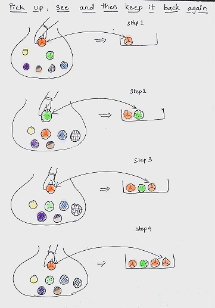
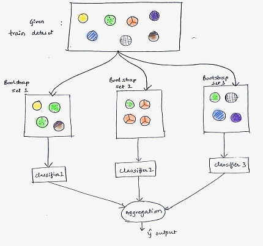
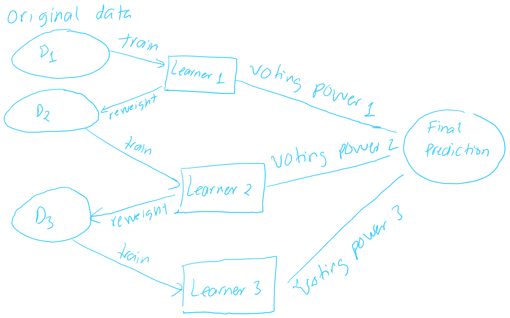
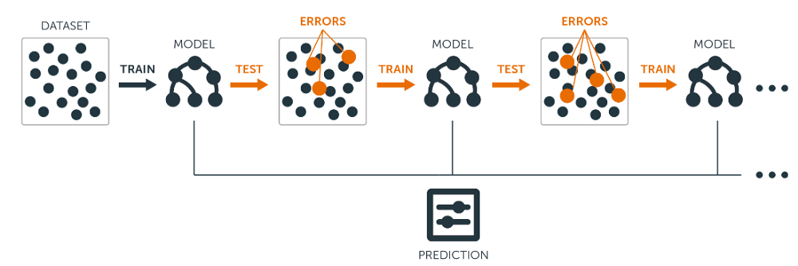
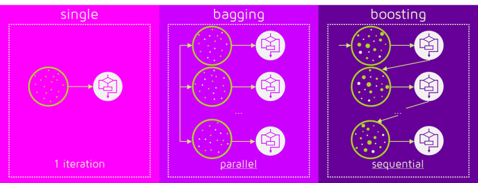
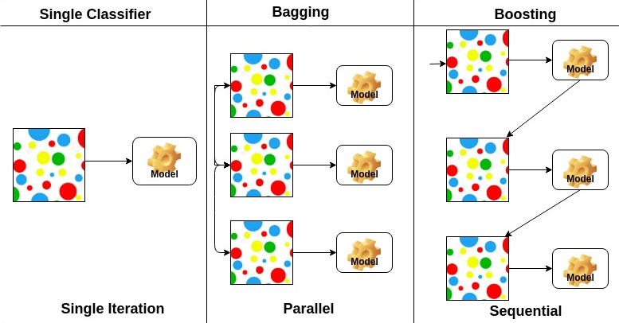
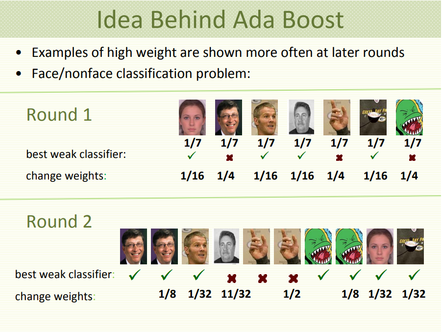
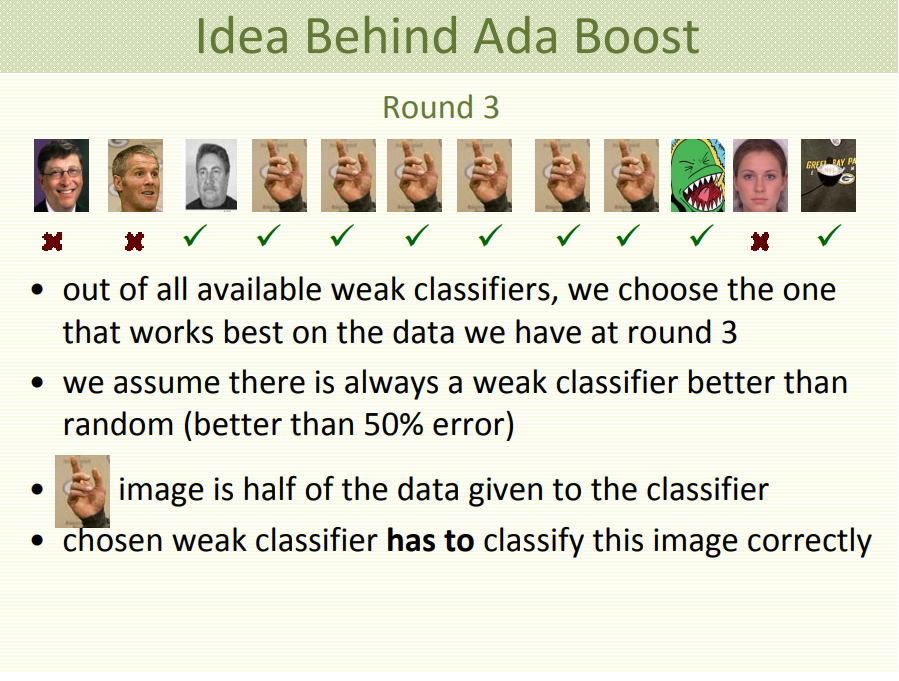

<style>

.remark-slide-content {
  background-color: #FFFFFF;
  border-top: 80px solid #F9C389;
  font-size: 20px;
  font-weight: 300;
  line-height: 1.5;
  padding: 1em 2em 1em 2em
}

.inverse {
  background-color: #696767;
  border-top: 80px solid #696767;
  text-shadow: none;
  background-image: url(https://github.com/goodekat/presentations/blob/master/2019-isugg-gganimate-spooky/figures/spider.png?raw=true);
	background-position: 50% 75%;
  background-size: 150px;
}

.your-turn{
  background-color: #8C7E95;
  border-top: 80px solid #F9C389;
  text-shadow: none;
  background-image: url(https://github.com/goodekat/presentations/blob/master/2019-isugg-gganimate-spooky/figures/spider.png?raw=true);
	background-position: 95% 90%;
  background-size: 75px;
}

.title-slide {
  background-color: #F9C389;
  border-top: 80px solid #F9C389;
  background-image: none;
}

.title-slide > h1  {
  color: #111111;
  font-size: 40px;
  text-shadow: none;
  font-weight: 400;
  text-align: left;
  margin-left: 15px;
  padding-top: 80px;
}
.title-slide > h2  {
  margin-top: -25px;
  padding-bottom: -20px;
  color: #111111;
  text-shadow: none;
  font-weight: 300;
  font-size: 35px;
  text-align: left;
  margin-left: 15px;
}
.title-slide > h3  {
  color: #111111;
  text-shadow: none;
  font-weight: 300;
  font-size: 25px;
  text-align: left;
  margin-left: 15px;
  margin-bottom: -30px;
}

</style>

```{css, echo=FALSE}
.left-code {
  color: #777;
  width: 40%;
  height: 92%;
  float: left;
}
.right-plot {
  width: 59%;
  float: right;
  padding-left: 1%;
}
```

# Netflix Prize

- 1 million USD to any one that can improve Netflix's rating algorithm...

---
# Netflix Prize

- 1 million USD to any one that can improve Netflix's rating algorithm **by 10%**


---
# Netflix Prize

- **The winning team:** 


---
# Netflix Prize

- **The winning team:** BellKor's Pragmatic Chaos, used **ensemble models**"

---
# Netflix Prize

- **The winning team:** BellKor's Pragmatic Chaos, used **ensemble models**"

- **The second-place team's name** is...

---
# Netflix Prize

- **The winning team:** BellKor's Pragmatic Chaos, used **ensemble models**"

- **The second-place team's name** is "The Ensemble"

---
# Netflix Prize

- "During the nearly 3 years of the Netflix competition, there were two main factors which improved the
overall accuracy: 

  - The quality of the individual algorithms, and 
  - the **ensemble idea**"


---
# Ensemble Success

> "XGBoost (an ensemble algorithm) is an algorithm that has recently been dominating applied machine learning and Kaggle competitions for structured or tabular data." [Link](https://machinelearningmastery.com/gentle-introduction-xgboost-applied-machine-learning/)

- List of machine learning winning solutions with XGBoost : https://github.com/dmlc/xgboost/tree/master/demo#machine-learning-challenge-winning-solutions

---
# Ensemble Success

> Adaboost (an ensemble algorithm) won 2003 **Godel Prize**: AdaBoost demonstrated novel possibilities in analysing data and is a permanent contribution to science even beyond computer science. [Link](http://eatcs.org/index.php/component/content/article/505)

---
# Ensemble Success

>AdaBoost (with decision trees as the weak learners) is often referred to as the best out-of-the-box classifier.  [Link](https://en.wikipedia.org/wiki/AdaBoost)

---
# Ensemble Success

> Leo Brieman, who invented "Bagging" and "Random Forest" crowned AdaBoost the "best off-the-shelf classifier in the world (2000). 


---
# Ensemble Machine Learning Approach

- An ensemble is a composite model, combining a series of low performing **classifiers**(classification models) or **learners** with the aim of creating an improved classifier.
    
---
# Ensemble Machine Learning Approach

- An ensemble is a composite model, combining a series of low performing **classifiers**(classification models) or **learners** with the aim of creating an improved classifier.

- Three common ensemble:

    - Stacking
    - Bagging
    - Boosting
    

---
# Stacking

- Stacking combines multiple base learners  predictions into a new data set. 

- This new data are treated as the **input data** for another learner (meta learner).


---
# Bagging  = Bootstrap Aggregating

.pull-left[

- Step 1:  Boostrapping

]

.pull-right[
```{r, out.height = "500px", echo = FALSE}

```
]


---
# Bagging = Bootstrap Aggregating

.pull-left[

- Step 2: Aggregating  

]

.pull-right[
```{r, out.height = "500px", echo = FALSE}

```
]


---
# Boosting

.pull-left[

- Weak learners are sequentially converted into a strong learner. 

]

.pull-right[
```{r, echo = FALSE}

```
]


---
# Boosting

.pull-left[

- Weak learners are sequentially converted into a strong learner. 

- Each leaner in the sequence tries to correct its predecessor. 


]

.pull-right[
```{r, echo = FALSE}

```
]

---
# Boosting

.pull-left[

- Weak learners are sequentially converted into a strong learner. 

- Each leaner in the sequence tries to correct its predecessor. 

- Individually, Learn 1, Learner 2 and Learner 3 are **weak leaners** (a little better than a coin toss). 

]

.pull-right[
```{r, echo = FALSE}

```
]

---
# Boosting

.pull-left[

- Weak learners are sequentially converted into a strong learner. 

- Each leaner in the sequence tries to correct its predecessor. 

- Individually, Learn 1, Learner 2 and Learner 3 are **weak leaners** (a little better than a coin toss). 

- The learners are usually a tree with 2 leaves (**Stump**).


]

.pull-right[
```{r, echo = FALSE}

```
]

---
# Boosting

.pull-left[

- Weak learners are sequentially converted into a strong learner. 

- Each leaner in the sequence tries to correct its predecessor. 

- Individually, Learn 1, Learner 2 and Learner 3 are **weak leaners** (a little better than a coin toss). 

- The learners are usually a tree with 2 leaves (**Stump**).

- In D2, the wrong misclassified of Learner 1 gets higher weights. 

- In D3, the wrong misclassified of Learner 2 gets higher weights. 
]

.pull-right[
```{r, echo = FALSE}

```
]

---
# Boosting 




---
# Bagging vs. Boosting



---
# Bagging vs. Boosting



---
# Types of Boosting

- Adaboost

- Gradient Boosting

---
# Adaboost



---
# Adaboost



---
# Adaboost, Clearly Explained


- Demonstration by StatQuest
- [Link](https://www.youtube.com/watch?v=LsK-xG1cLYA)
