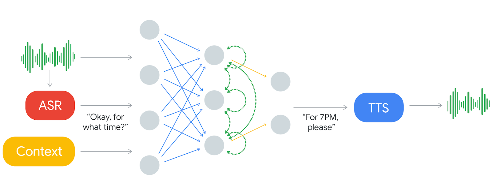

<style>

.remark-slide-content {
  background-color: #FFFFFF;
  border-top: 80px solid #F9C389;
  font-size: 20px;
  font-weight: 300;
  line-height: 1.5;
  padding: 1em 2em 1em 2em
}

.inverse {
  background-color: #696767;
  border-top: 80px solid #696767;
  text-shadow: none;
  background-image: url(https://github.com/goodekat/presentations/blob/master/2019-isugg-gganimate-spooky/figures/spider.png?raw=true);
	background-position: 50% 75%;
  background-size: 150px;
}

.your-turn{
  background-color: #8C7E95;
  border-top: 80px solid #F9C389;
  text-shadow: none;
  background-image: url(https://github.com/goodekat/presentations/blob/master/2019-isugg-gganimate-spooky/figures/spider.png?raw=true);
	background-position: 95% 90%;
  background-size: 75px;
}

.title-slide {
  background-color: #F9C389;
  border-top: 80px solid #F9C389;
  background-image: none;
}

.title-slide > h1  {
  color: #111111;
  font-size: 40px;
  text-shadow: none;
  font-weight: 400;
  text-align: left;
  margin-left: 15px;
  padding-top: 80px;
}
.title-slide > h2  {
  margin-top: -25px;
  padding-bottom: -20px;
  color: #111111;
  text-shadow: none;
  font-weight: 300;
  font-size: 35px;
  text-align: left;
  margin-left: 15px;
}
.title-slide > h3  {
  color: #111111;
  text-shadow: none;
  font-weight: 300;
  font-size: 25px;
  text-align: left;
  margin-left: 15px;
  margin-bottom: -30px;
}

</style>

```{css, echo=FALSE}
.left-code {
  color: #777;
  width: 50%;
  height: 92%;
  float: left;
}
.right-plot {
  width: 49%;
  float: right;
  padding-left: 1%;
}
```


```{css, echo=FALSE}
.pull-left {
  color: #777;
  width: 30%;
  height: 92%;
  float: left;
}
.pull-right {
  width: 69%;
  float: right;
  padding-left: 1%;
}
```

---
# Agenda

- Deep learning revolution

- Python Example

  - Apple diseases Detection: CNN vs. Gradient Boosting 
  
  - Pneumonia X-ray detection
  
  - GAN

- Define neural networks


---
# Deep Learning


```{r, echo = FALSE}

```


---
# Example

https://www.youtube.com/watch?v=l82PxsKHxYc&t=47s

---

# 2009: ImageNet Competition

.pull-left[

- Launched in 2009

- 15 million high-resolution images

- 22,000 categories]

.pull-right[

```{r, echo = FALSE, fig.height=.1}

```
]
---
# AlexNet

.pull-left[

- Dramatic performance gain

- No Teams get better than 25% accuracy by 2012

- AlexNet was imtroduce in 2012 with 15.3% accuracy

- No team did worst than 25% since


]

.pull-right[
```{r, echo = FALSE}

```
]


---
# AlexNet


```{r, echo = FALSE}
knitr::include_graphics("images/cnn8.png")
```


---
# CNN


```{r, echo = FALSE}

```

---
# 2014: DeepFace - Facebook

- In 2014, Facebook - DeepFace can identify faces with 97.35% accuracy, beating rivals human performance

```{r, echo = FALSE}

```

---
# 2016: AlphaGo - Google

- In 2016, AlphaGo became the first computer program to defeat a professional human Go player

- the first to defeat a Go world champion,

- arguably the strongest Go player in history.

- AlphaGo was one of the Breakthrough of the Year by Science. 


```{r, echo = FALSE, fig.align="center"}

```

---
# 2016: Google Translate

- In 2016, Google Translate Deep Learning blew other language translation techniques out of the water

```{r, echo = FALSE}

```

---
# Google Assistant

https://ai.googleblog.com/2018/05/duplex-ai-system-for-natural-conversation.html

```{r, echo = FALSE}

```

---
# 2017: Face ID - Apple

- In 2017, Apple switched to use Deep Learning for face recognition

> We had to completely rethink our approach so that we could take advantage of this paradigm shift. https://machinelearning.apple.com/research/face-detection

```{r, echo = FALSE, fig.align="center"}

```

---
# Apple Siri

https://machinelearning.apple.com/research/siri-voices

```{r, echo = FALSE}

```

---
# Apple - Deep Learning


```{r, echo = FALSE}

```

---
# Amazon

```{r, echo = FALSE}

```

---
class: inverse, middle, center
# Academia

---
# Academia

```{r, echo = FALSE, fig.align="center", fig.height=1}

```

---
# 2018: Alan Turing Award

```{r, echo = FALSE, fig.align="center", fig.height=1}
knitr::include_graphics("images/turing.jpg")
```

---
class: inverse, middle, center

# Big Tech Companies Interested

---
# Google

- In 2014, Google acquired DeepMind. 

- https://deepmind.com/research/case-studies/alphago-the-story-so-far

- https://en.wikipedia.org/wiki/DeepMind

- https://www.tensorflow.org/about

---
# Tensorflow

- Google developed TensorFlow in 2015

- particularly focuses on training and inference of deep neural networks.

- Company uses Tensorflow

```{r, echo = FALSE}
knitr::include_graphics("images/cnn_tensor_flow.png")
```

- https://www.tensorflow.org/about

---
# Google Brain

- Google Brain is a deep learning artificial intelligence research team at Google. 

- Formed in the early 2010s

- https://research.google/teams/brain/


---
# Apple

- Deep Learning Team: 

https://www.apple.com/jobs/us/teams/machine-learning-and-ai.html

---
# Facebook: Pytoch

- In 2016, Facebook developed PyTorch, an open source deep learning framework

---
# Microsoft

Deep Learning Group: https://www.microsoft.com/en-us/research/group/deep-learning-group/

---
class: inverse, center, middle

# But...

---
# But...

- Neural Network was invented a long time ago

- Why now?

---
# CNN


```{r, echo = FALSE, fig.align="center"}

```

---
# Big Data

```{r, echo = FALSE, fig.align="center"}

```


---
# Big Data

```{r, echo = FALSE, fig.align="center"}

```


---
# Big Data

```{r, echo = FALSE, fig.align="center"}

```

---
# Powerful Computing

```{r, echo = FALSE, fig.align="center"}


```

- https://en.wikipedia.org/wiki/History_of_supercomputing


---
# Powerful Computing
```{r, echo = FALSE, fig.align="center"}

```

---
# Powerful Computing

- If AlphaGoZero was trained in 1 day in 2020, how long would it take to train AlphaGoZero in 2012?

- More than 821 years!

---
# Cheaper Computing

```{r, echo = FALSE, fig.align="center"}

```


---
# CNN


```{r, echo = FALSE}

```

---
class: middle, inverse, center

# Neural Network

---
# A linear Model is a Neural Network


---
# Number of Parameters

```{r, echo = FALSE}

```

- FLOP: Number of Operations
---
# Deeper and Deeper


```{r, echo = FALSE}

```
