<style>

.remark-slide-content {
  background-color: #FFFFFF;
  border-top: 80px solid #F9C389;
  font-size: 20px;
  font-weight: 300;
  line-height: 1.5;
  padding: 1em 2em 1em 2em
}

.inverse {
  background-color: #696767;
  border-top: 80px solid #696767;
  text-shadow: none;
  background-image: url(https://github.com/goodekat/presentations/blob/master/2019-isugg-gganimate-spooky/figures/spider.png?raw=true);
	background-position: 50% 75%;
  background-size: 150px;
}

.your-turn{
  background-color: #8C7E95;
  border-top: 80px solid #F9C389;
  text-shadow: none;
  background-image: url(https://github.com/goodekat/presentations/blob/master/2019-isugg-gganimate-spooky/figures/spider.png?raw=true);
	background-position: 95% 90%;
  background-size: 75px;
}

.title-slide {
  background-color: #F9C389;
  border-top: 80px solid #F9C389;
  background-image: none;
}

.title-slide > h1  {
  color: #111111;
  font-size: 40px;
  text-shadow: none;
  font-weight: 400;
  text-align: left;
  margin-left: 15px;
  padding-top: 80px;
}
.title-slide > h2  {
  margin-top: -25px;
  padding-bottom: -20px;
  color: #111111;
  text-shadow: none;
  font-weight: 300;
  font-size: 35px;
  text-align: left;
  margin-left: 15px;
}
.title-slide > h3  {
  color: #111111;
  text-shadow: none;
  font-weight: 300;
  font-size: 25px;
  text-align: left;
  margin-left: 15px;
  margin-bottom: -30px;
}

</style>

```{css, echo=FALSE}
.left-code {
  color: #777;
  width: 50%;
  height: 92%;
  float: left;
}
.right-plot {
  width: 49%;
  float: right;
  padding-left: 1%;
}
```

# Classification Problem

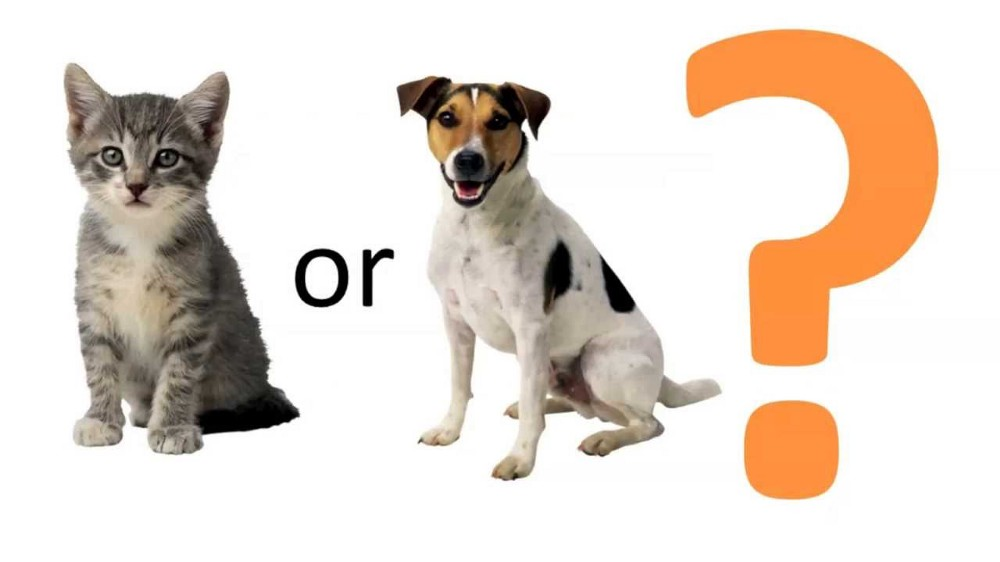
---
# Classification Problem

.pull-left[


]

.pull-right[
```{r, echo = FALSE}

```
]

---
# Classification Problem

.pull-left[

- Credit Card Default?


]

.pull-right[
```{r, echo = FALSE}

```
]


---
# Classification Problem

.pull-left[

- Credit Card Default?

- Or not?

]

.pull-right[
```{r, echo = FALSE}

```
]


---
# Classification Problem


.pull-left[


- Is A yellow?

]

.pull-right[

```{r, echo = FALSE}
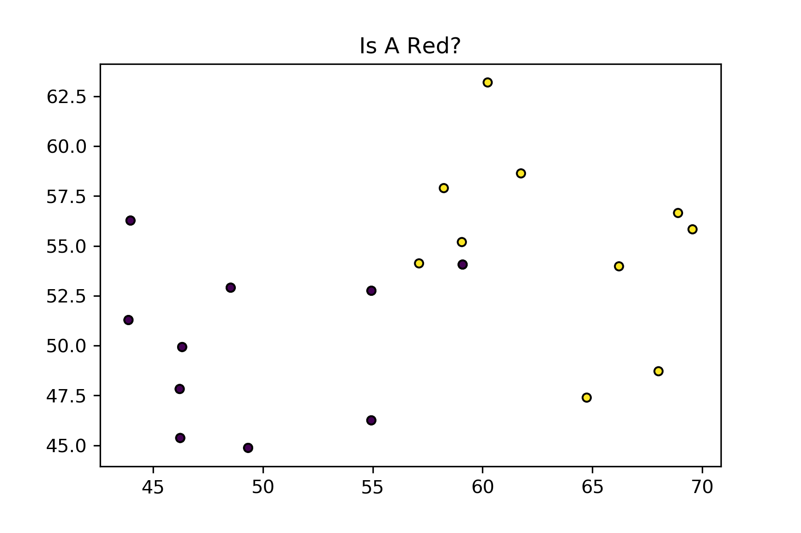
```
]

---
# Classification Problem


.pull-left[


- Is A yellow?

- Or purple?

]

.pull-right[

```{r, echo = FALSE}

```
]


---
# Classification Problem


.pull-left[


- Decision Boundary


]

.pull-right[

```{r, echo = FALSE}
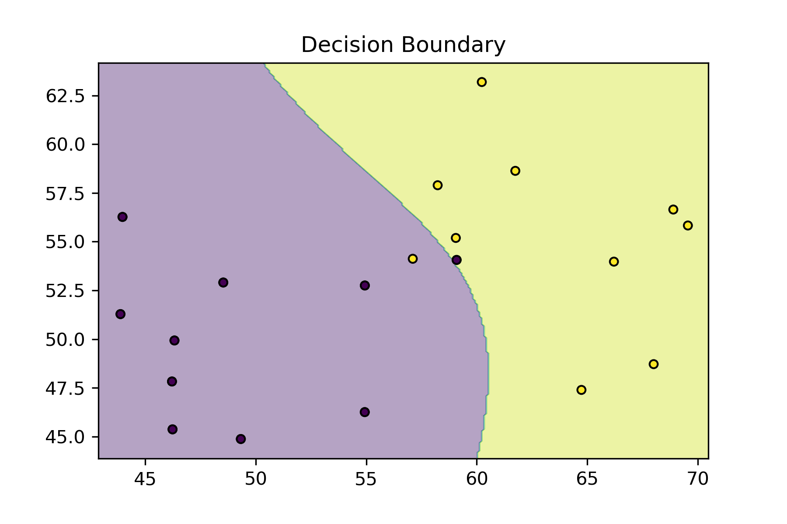
```
]

---
# Classification Problem


.pull-left[


- Decision Boundary

- of a classification model

]

.pull-right[

```{r, echo = FALSE}

```
]

---
# Classification Problem


.pull-left[


- Decision Boundary

- of a classification model

- A is...

]

.pull-right[

```{r, echo = FALSE}

```
]

---
# Accuracy

.pull-left[


|   Purple Accuracy  |   Yellow Accuracy  |      Balanced Accuracy  |
|-------------------:|-------------------:|--------------------:|
 |                0.9 |                0.9 |                      0.9 |

]

.pull-right[
```{r, echo = FALSE}

```
]

---
# Balance vs. Unbalanced Data

.pull-left[

```{r, echo = FALSE}
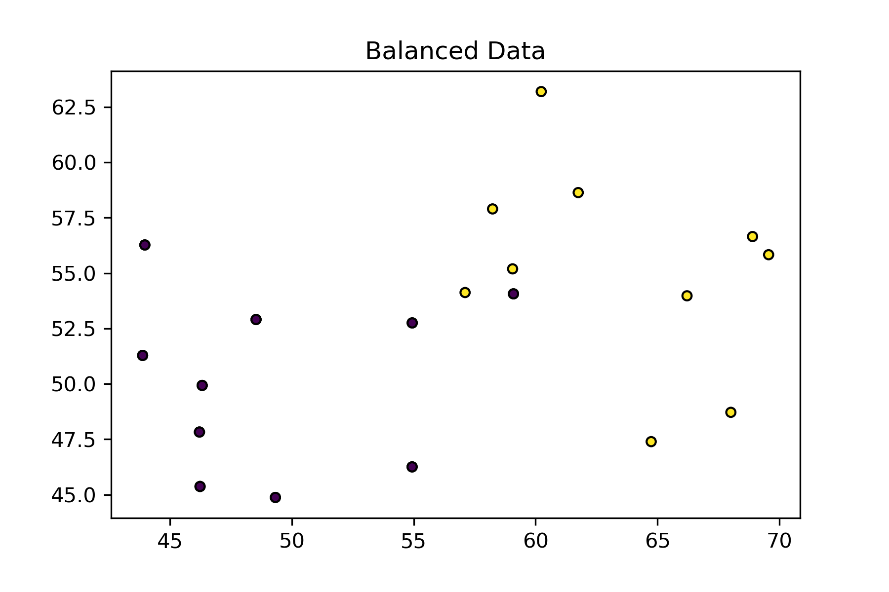
```
]


---
# Balance vs. Unbalanced Data

.pull-left[

```{r, echo = FALSE}

```

]

.pull-right[
```{r, echo = FALSE}

```
]

---
# Decision Boundary of Unbalanced Data

.pull-left[

```{r, echo = FALSE}

```

]

.pull-right[

]


---
# Decision Boundary of Unbalanced Data

.pull-left[

```{r, echo = FALSE}

```


]

.pull-right[
```{r, echo = FALSE}
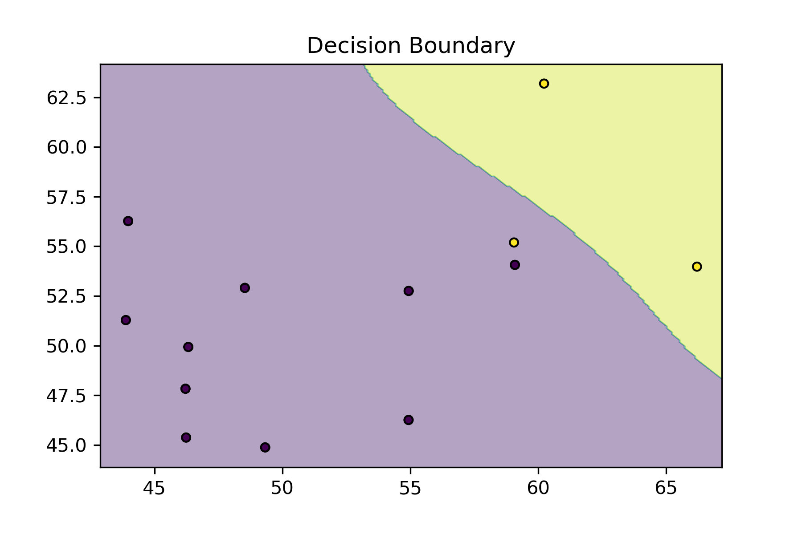
```


]

---
# Decision Boundary of Unbalanced Data

.pull-left[

```{r, echo = FALSE}

```


]

.pull-right[
```{r, echo = FALSE}

```

```{r, echo = FALSE}
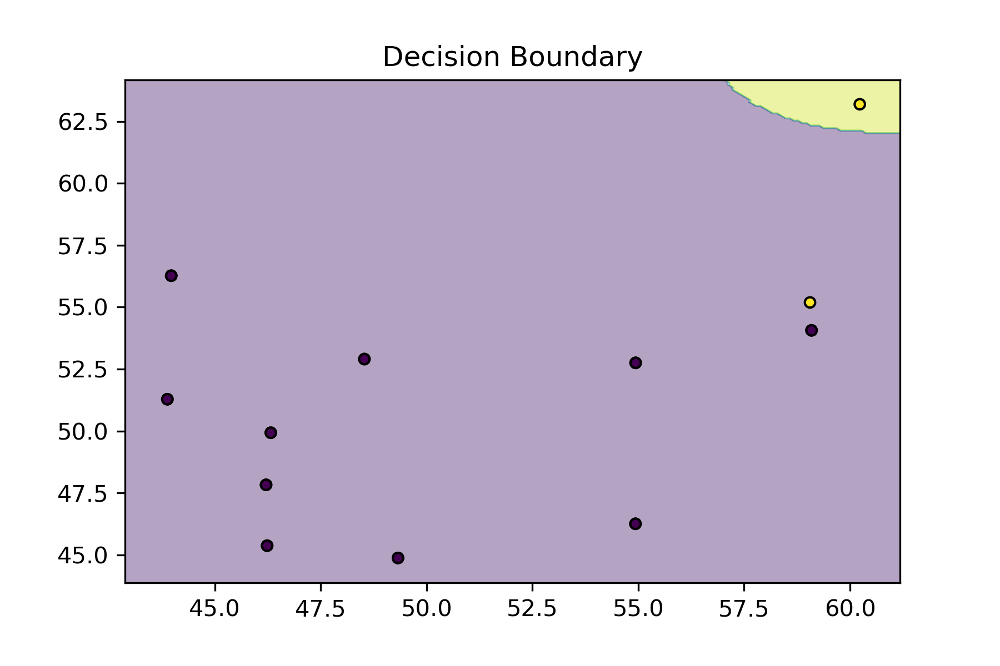
```

]


---
# Decision Boundary of Unbalanced Data

.pull-left[

```{r, echo = FALSE}

```

```{r, echo = FALSE}
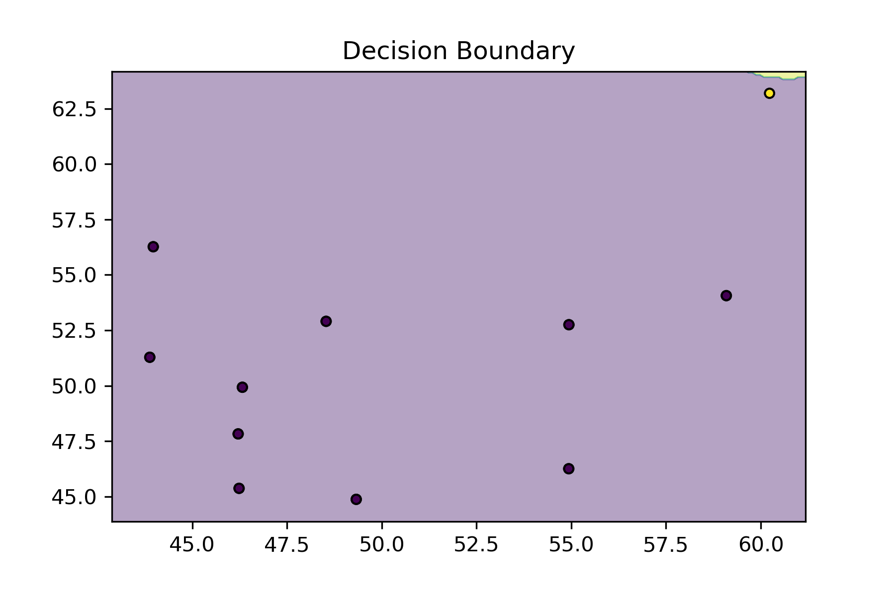
```

]

.pull-right[
```{r, echo = FALSE}

```

```{r, echo = FALSE}

```

]

---
# Accuracy

.pull-left[


|   Yellow Accuracy  |   Purple Accuracy  |      Balanced Accuracy  |
|-------------------:|-------------------:|--------------------:|
 |                0.9 |                0.9 |                 0.9 |

]

.pull-right[
```{r, echo = FALSE}

```
]

---
# Accuracy

.pull-left[


|   Yellow Accuracy  |   Purple Accuracy  |      Balanced Accuracy  |
|-------------------:|-------------------:|--------------------:|
|               0.75 |                  1 |                  0.875 |

]

.pull-right[
```{r, echo = FALSE}
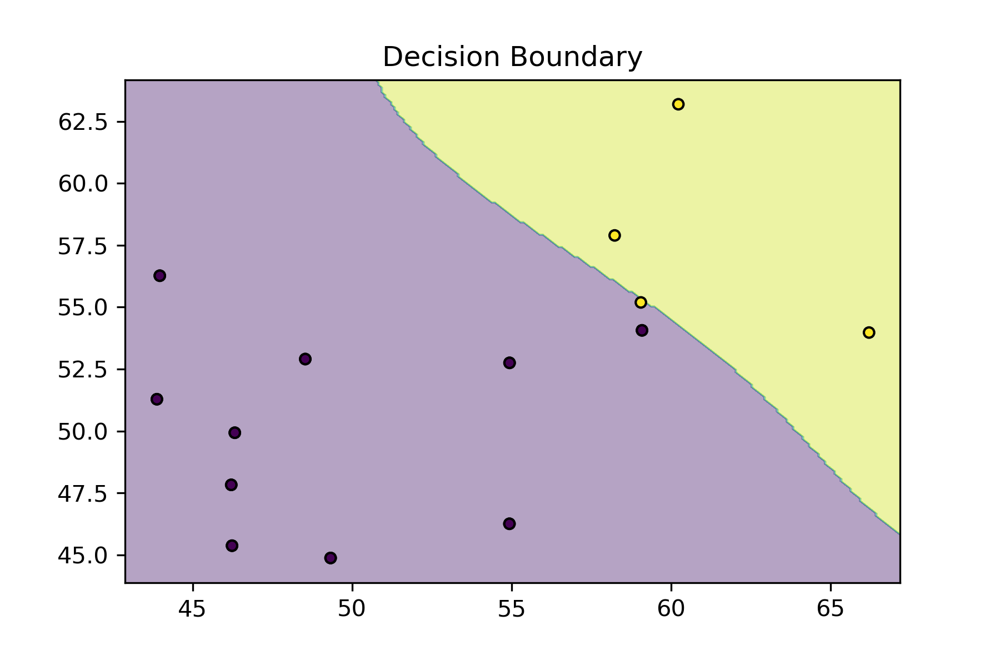
```
]

---
# Accuracy

.pull-left[


|   Yellow Accuracy  |   Purple Accuracy  |      Balanced Accuracy  |
|-------------------:|-------------------:|---------------------:|
 |           0.666667 |                  1 |                0.833333 |

]

.pull-right[
```{r, echo = FALSE}

```
]

---
# Accuracy

.pull-left[


|   Yellow Accuracy  |   Purple Accuracy  |      Balanced Accuracy  |
|-------------------:|-------------------:|---------------------:|
|                0.5 |                  1 |                    0.75 |
]

.pull-right[
```{r, echo = FALSE}

```
]


---
# Accuracy

.pull-left[


    |   Yellow Accuracy  |   Purple Accuracy  |      Balanced Accuracy  |
|-------------------:|-------------------:|---------------------:|
 |                  0 |                  1 |                     0.5 |

]

.pull-right[
```{r, echo = FALSE}

```
]

---

- It's more difficult to detect yellow points when the imbalance increases

- Yellow points could present

  - Cancer Patients, 
  - Credit Card Fraud, 
  - Bankrupted Companies, 
  - Terrorist 

- They are all rare events.

---
# Question

- How to detect the yellow points when there are too few of them?


---
# Strategy 1

.pull-left[

- Remove the purple points so that the data more balanced


]

.pull-right[

]

---
# Strategy 1

.pull-left[

- Remove the purple points so that the data more balanced

- This is called under-sampling
]

.pull-right[

]


---
# Strategy 1

.pull-left[

- Remove the purple points so that the data more balanced

- This is called under-sampling
]

.pull-right[
```{r, echo = FALSE}
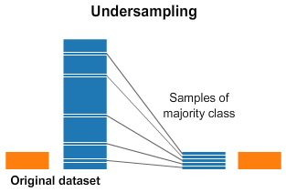
```
]

---
# Undersampling

.pull-left[
```{r, echo = FALSE}
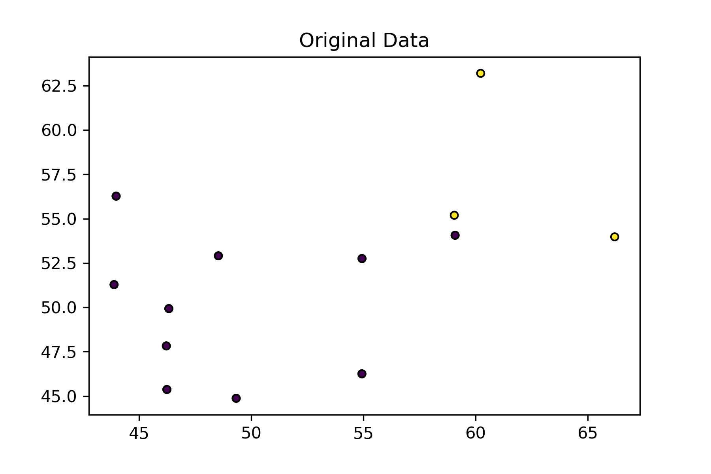
```

```{r, echo = FALSE}
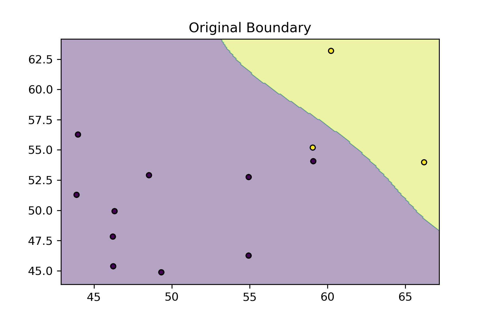
```

]

.pull-right[

]


---
# Undersampling

.pull-left[
```{r, echo = FALSE}

```

```{r, echo = FALSE}

```

]

.pull-right[
```{r, echo = FALSE}
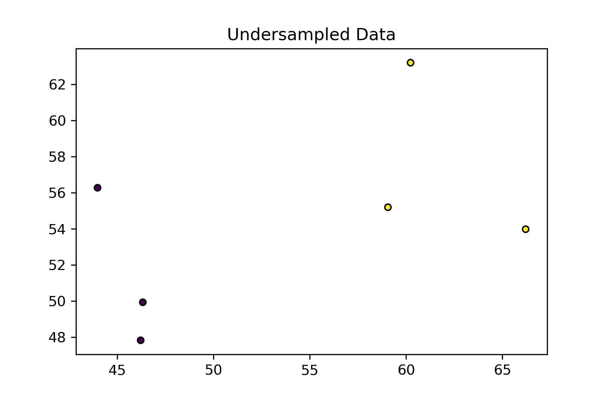
```
]


---
# Undersampling

.pull-left[
```{r, echo = FALSE}

```

```{r, echo = FALSE}

```
]

.pull-right[
```{r, echo = FALSE}

```

```{r, echo = FALSE}
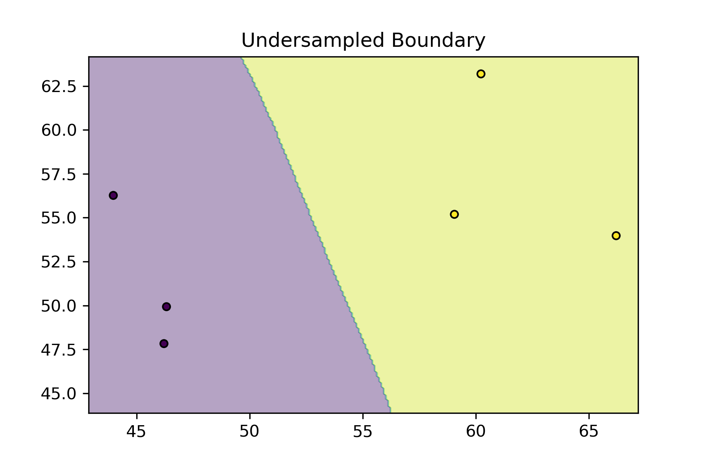
```
]


---
# Undersampling

.pull-left[
```{r, echo = FALSE}

```

|   Yellow Accuracy  |   Purple Accuracy  |      Balanced Accuracy  |
|-------------------:|-------------------:|---------------------:|
|           0.666667 |                  1 |               0.833333 |

]

.pull-right[

```{r, echo = FALSE}

```

|   Yellow Accuracy  |   Purple Accuracy  |      Balanced Accuracy  |
|-------------------:|-------------------:|---------------------:|
|                  1 |                0.8 |                    0.9 |

]


---
# Undersampling

.pull-left[
```{r, echo = FALSE}
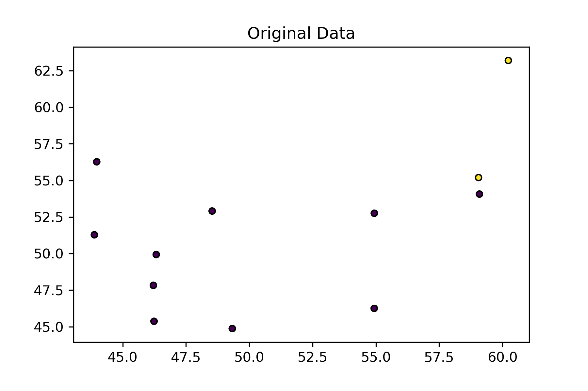
```

```{r, echo = FALSE}

```
]

.pull-right[

]

---
# Undersampling

.pull-left[
```{r, echo = FALSE}

```

```{r, echo = FALSE}

```
]

.pull-right[
```{r, echo = FALSE}
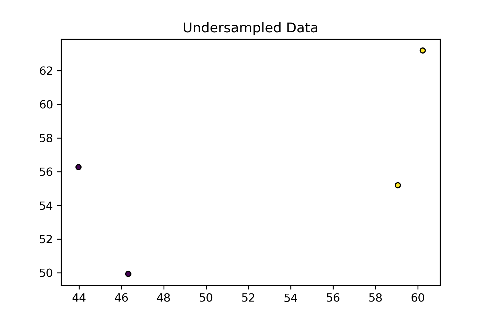
```


]


---
# Undersampling

.pull-left[
```{r, echo = FALSE}

```

```{r, echo = FALSE}

```
]

.pull-right[
```{r, echo = FALSE}

```

```{r, echo = FALSE}
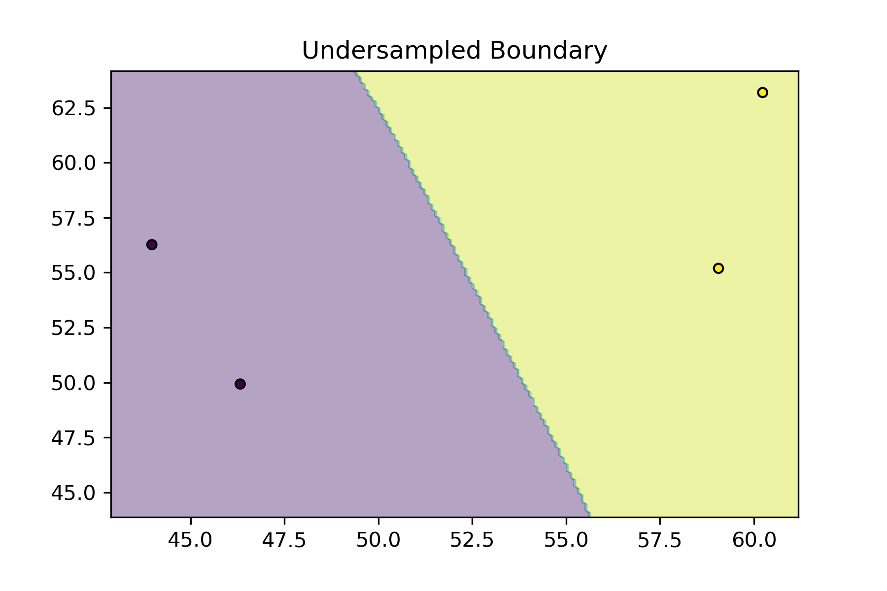
```
]


---
# Undersampling

.pull-left[
```{r, echo = FALSE}

```

|   Yellow Accuracy  |   Purple Accuracy  |      Balanced Accuracy  |
|-------------------:|-------------------:|---------------------:|
|                0.5 |                  1 |                   0.75 |

]

.pull-right[

```{r, echo = FALSE}

```

|   Yellow Accuracy  |   Purple Accuracy  |      Balanced Accuracy  |
|-------------------:|-------------------:|---------------------:|
|                  1 |                0.8 |                    0.9 |

]


---
# Undersampling

.pull-left[
```{r, echo = FALSE}
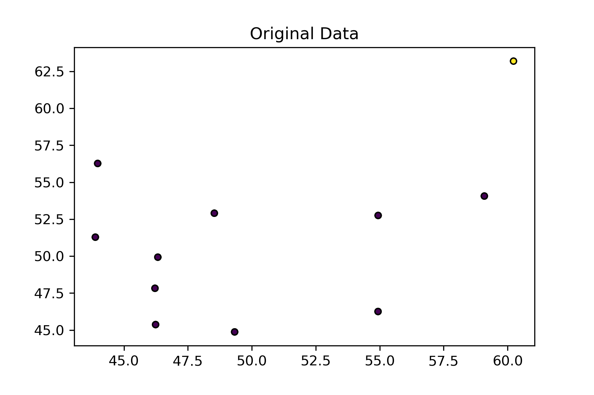
```

```{r, echo = FALSE}
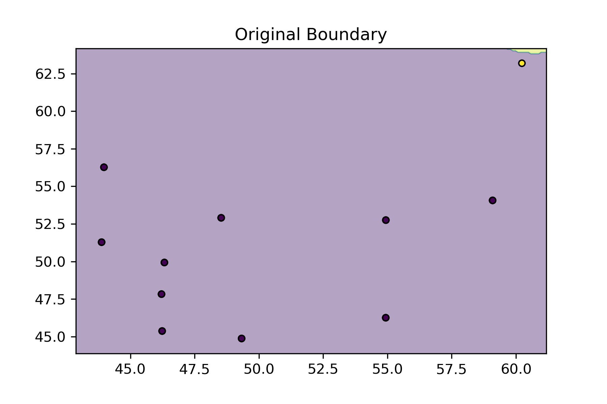
```
]

.pull-right[

]


---
# Undersampling

.pull-left[
```{r, echo = FALSE}

```

```{r, echo = FALSE}

```
]

.pull-right[
```{r, echo = FALSE}
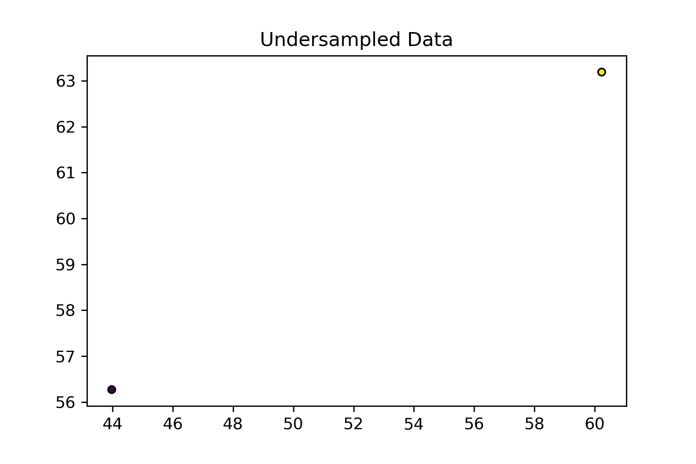
```

]


---
# Undersampling

.pull-left[
```{r, echo = FALSE}

```

```{r, echo = FALSE}

```
]

.pull-right[
```{r, echo = FALSE}

```

```{r, echo = FALSE}
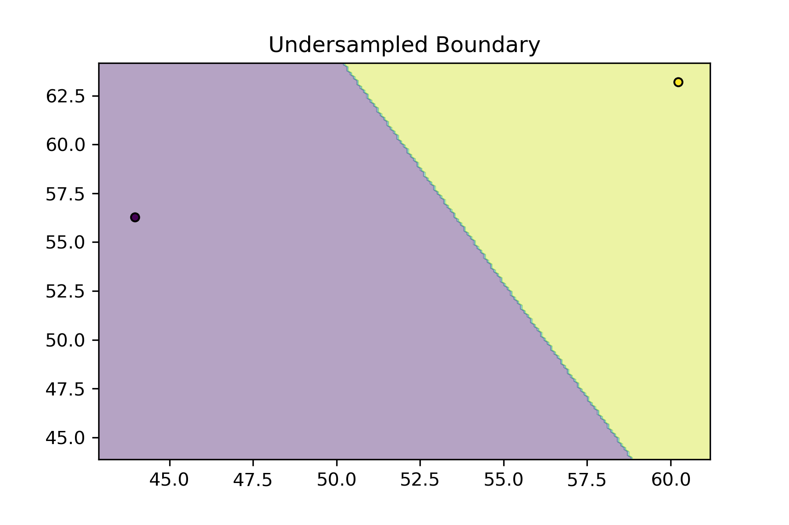
```
]

---
# Undersampling

.pull-left[
```{r, echo = FALSE}

```

 |   Yellow Accuracy  |   Purple Accuracy  |   Balanced Accuracy  |
|-------------------:|-------------------:|---------------------:|
 |                  0 |                  1 |                  0.5 |

]

.pull-right[

```{r, echo = FALSE}

```

|   Yellow Accuracy  |   Purple Accuracy  |   Balanced Accuracy  |
|-------------------:|-------------------:|---------------------:|
|                  1 |                0.9 |                 0.95 |

]

---
# Strategy 2

.pull-left[

- Duplicate the yellow points many times so that the data more balanced

- This is called Over-sampling
]

.pull-right[
```{r, echo = FALSE}
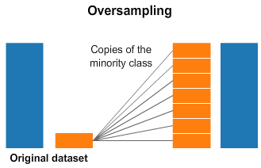
```
]


---
# Oversampling

.pull-left[
```{r, echo = FALSE}

```

```{r, echo = FALSE}

```
]

.pull-right[

]


---
# Oversampling

.pull-left[
```{r, echo = FALSE}

```

```{r, echo = FALSE}

```
]

.pull-right[
```{r, echo = FALSE}
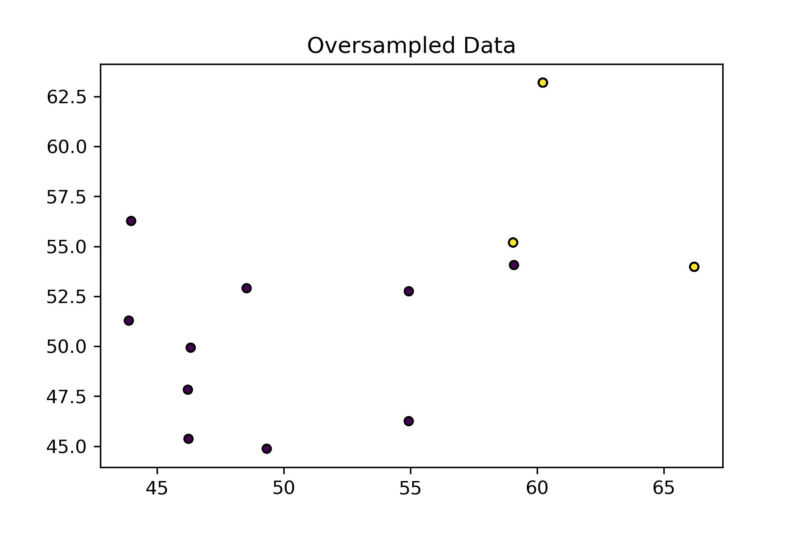
```


]

---
# Oversampling

.pull-left[
```{r, echo = FALSE}

```

```{r, echo = FALSE}

```
]

.pull-right[
```{r, echo = FALSE}

```

```{r, echo = FALSE}
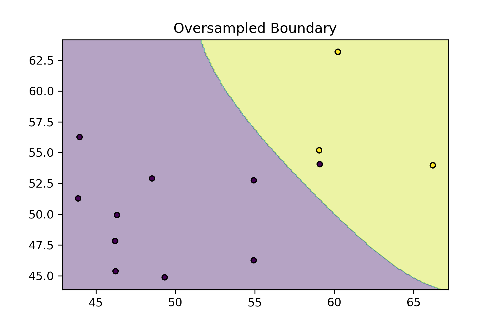
```
]


---
# Oversampling

.pull-left[
```{r, echo = FALSE}

```


|   Yellow Accuracy  |   Purple Accuracy  |      Balanced Accuracy  |
|-------------------:|-------------------:|---------------------:|
|           0.666667 |                  1 |             0.833333 |

]

.pull-right[


```{r, echo = FALSE}

```

|   Yellow Accuracy  |   Purple Accuracy  |      Balanced Accuracy  |
|-------------------:|-------------------:|---------------------:|
|                  1 |                0.9 |                 0.95 |


]


---
# Oversampling

.pull-left[
```{r, echo = FALSE}

```

```{r, echo = FALSE}

```
]

.pull-right[

]


---
# Oversampling

.pull-left[
```{r, echo = FALSE}

```

```{r, echo = FALSE}

```
]

.pull-right[
```{r, echo = FALSE}
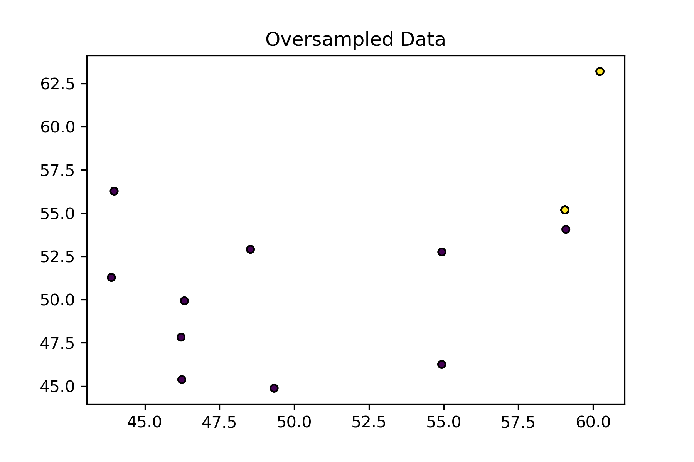
```


]

---
# Oversampling

.pull-left[
```{r, echo = FALSE}

```

```{r, echo = FALSE}

```
]

.pull-right[
```{r, echo = FALSE}

```

```{r, echo = FALSE}
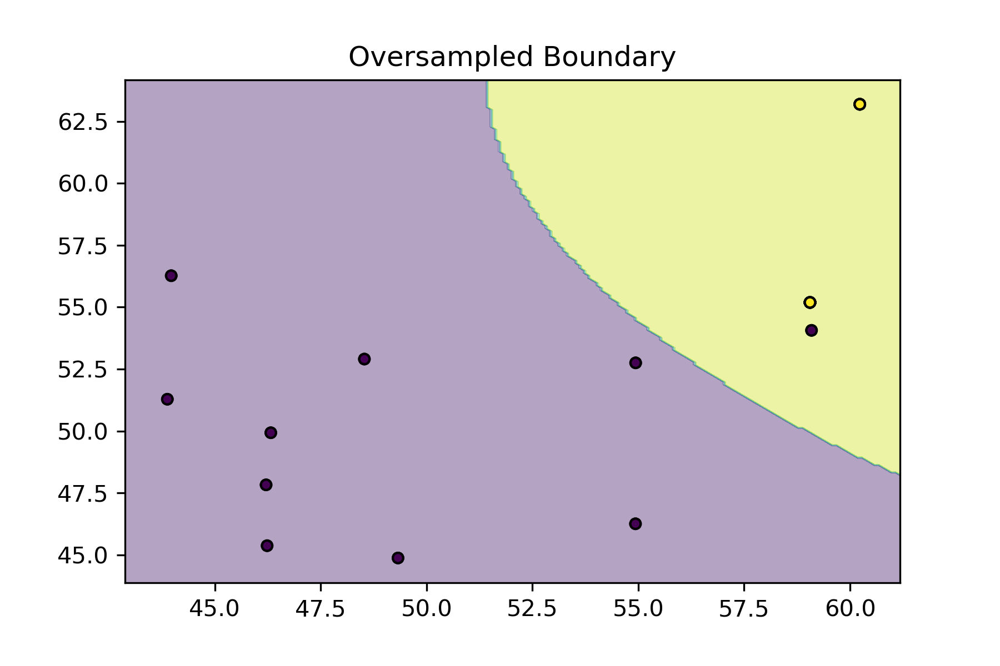
```
]

---
# Oversampling

.pull-left[
```{r, echo = FALSE}

```


|   Yellow Accuracy  |   Purple Accuracy  |      Balanced Accuracy  |
|-------------------:|-------------------:|---------------------:|
|                0.5 |                  1 |                   0.75 |

]

.pull-right[


```{r, echo = FALSE}

```

|   Yellow Accuracy  |   Purple Accuracy  |      Balanced Accuracy  |
|-------------------:|-------------------:|---------------------:|
|                  1 |                0.9 |                 0.95 |

]


---
# Oversampling

.pull-left[
```{r, echo = FALSE}

```

```{r, echo = FALSE}

```
]

.pull-right[

]


---
# Oversampling

.pull-left[
```{r, echo = FALSE}

```

```{r, echo = FALSE}

```
]

.pull-right[
```{r, echo = FALSE}
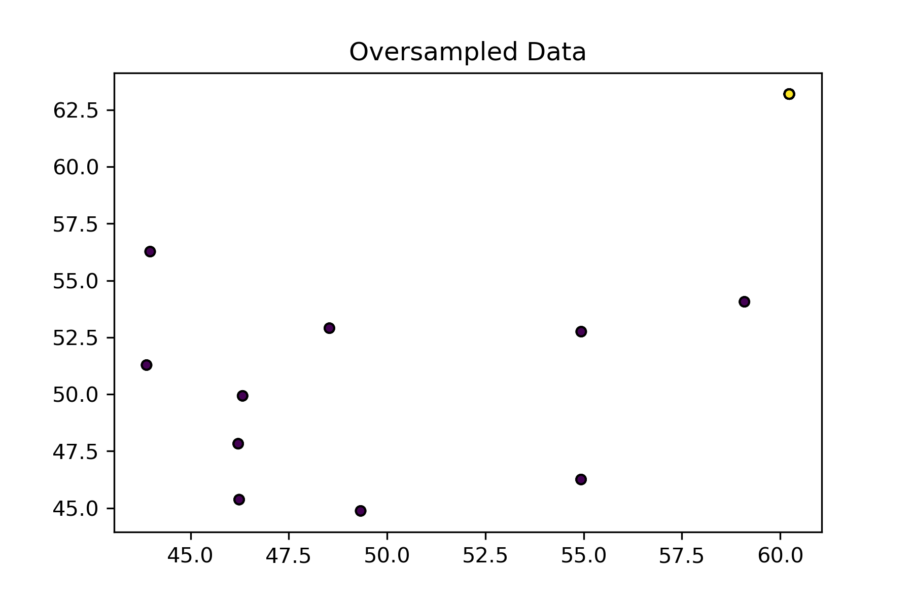
```


]

---
# Oversampling

.pull-left[
```{r, echo = FALSE}

```

```{r, echo = FALSE}

```
]

.pull-right[
```{r, echo = FALSE}

```

```{r, echo = FALSE}
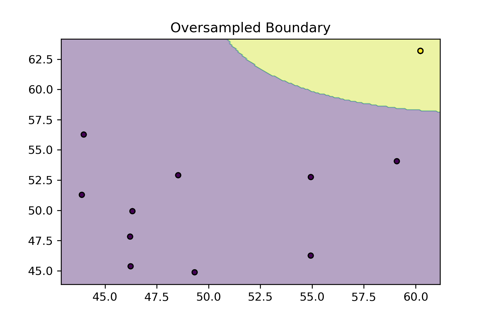
```
]


---
# Oversampling

.pull-left[
```{r, echo = FALSE}

```


|   Yellow Accuracy  |   Purple Accuracy  |      Balanced Accuracy  |
|-------------------:|-------------------:|---------------------:|
|                  0 |                  1 |                  0.5 |

]

.pull-right[


```{r, echo = FALSE}

```

|   Yellow Accuracy  |   Purple Accuracy  |      Balanced Accuracy  |
|-------------------:|-------------------:|---------------------:|
|                  1 |                  1 |                  1 |

]


---
# Strategy 3:

- Generate fake purple points

---
# SMOTE

```{r, echo = FALSE}
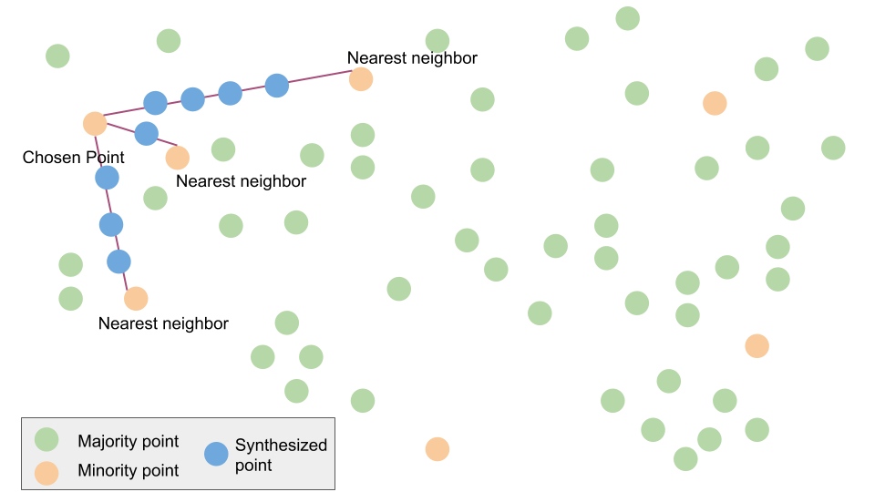
```
---
# SMOTE

.pull-left[
```{r, echo = FALSE}
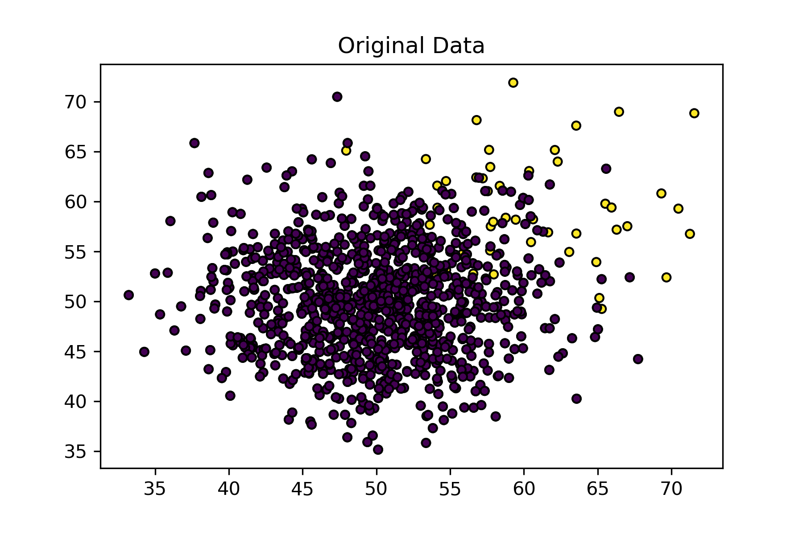
```

```{r, echo = FALSE}
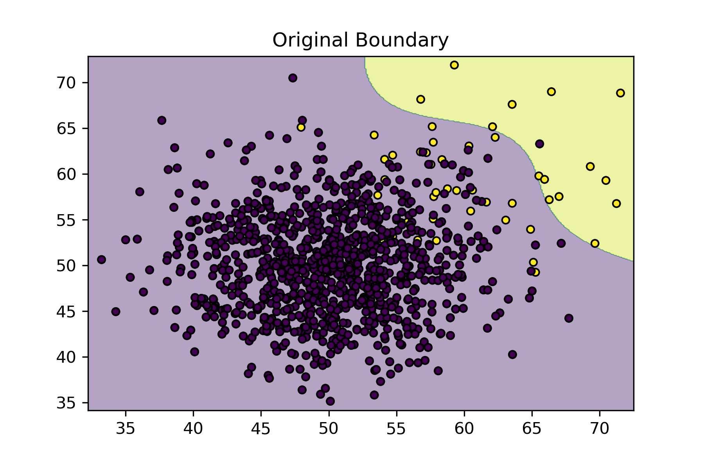
```
]

.pull-right[

]


---
# SMOTE

.pull-left[
```{r, echo = FALSE}

```

```{r, echo = FALSE}

```
]

.pull-right[
```{r, echo = FALSE}
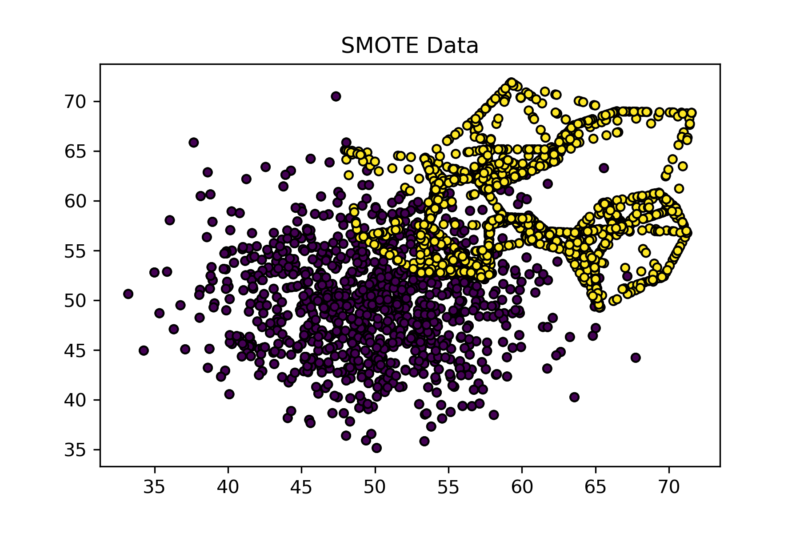
```


]

---
# SMOTE

.pull-left[
```{r, echo = FALSE}

```

```{r, echo = FALSE}

```
]

.pull-right[
```{r, echo = FALSE}

```

```{r, echo = FALSE}
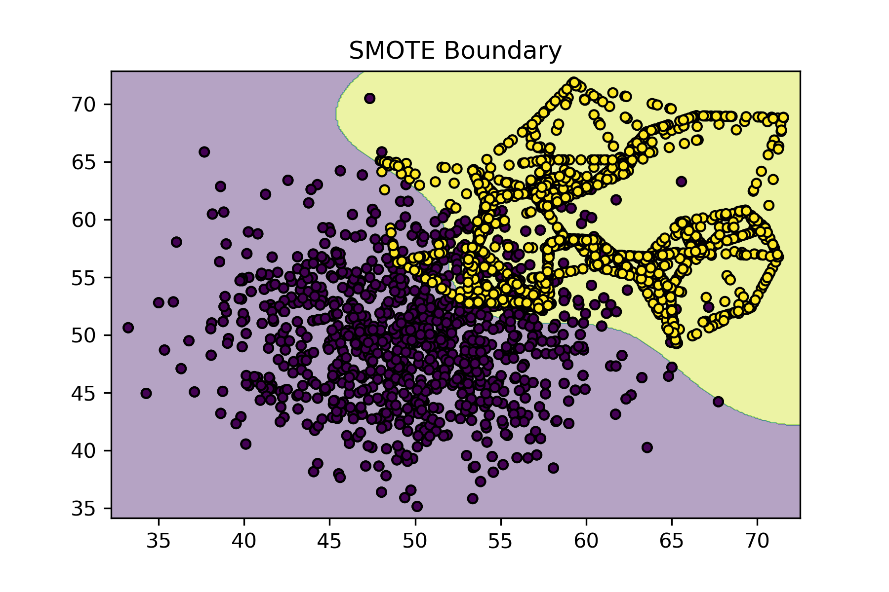
```
]


---
# SMOTE - Accuracy

.pull-left[
```{r, echo = FALSE}

```

|   Yellow Accuracy  |   Purple Accuracy  |      Balanced Accuracy  |
|-------------------:|-------------------:|---------------------:|
|               0.28 |              0.999 |               0.6395 |
]

.pull-right[
```{r, echo = FALSE}

```

|   Yellow Accuracy  |   Purple Accuracy  |      Balanced Accuracy  |
|-------------------:|-------------------:|---------------------:|
|               0.96 |              0.864 |                 0.912 |


]


---
# Borderline-SMOTE

```{r, echo = FALSE}
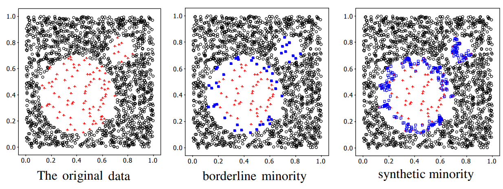
```


---
# Borderline-SMOTE

.pull-left[
```{r, echo = FALSE}
knitr::include_graphics("dbsmote_ori_data0.05.png")
```

```{r, echo = FALSE}
knitr::include_graphics("dbsmote_ori_db0.05.png")
```
]

.pull-right[

]


---
# Borderline-SMOTE

.pull-left[
```{r, echo = FALSE}
knitr::include_graphics("dbsmote_ori_data0.05.png")
```

```{r, echo = FALSE}
knitr::include_graphics("dbsmote_ori_db0.05.png")
```
]

.pull-right[
```{r, echo = FALSE}
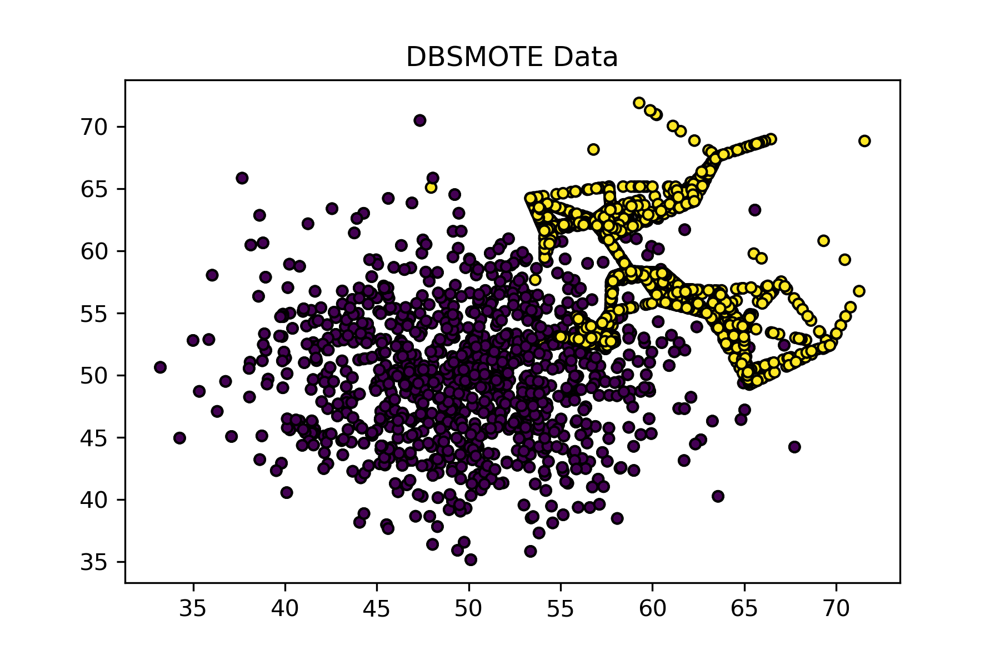
```


]


---
# Borderline-SMOTE

.pull-left[
```{r, echo = FALSE}
knitr::include_graphics("dbsmote_ori_data0.05.png")
```

```{r, echo = FALSE}
knitr::include_graphics("dbsmote_ori_db0.05.png")
```
]

.pull-right[
```{r, echo = FALSE}

```

```{r, echo = FALSE}
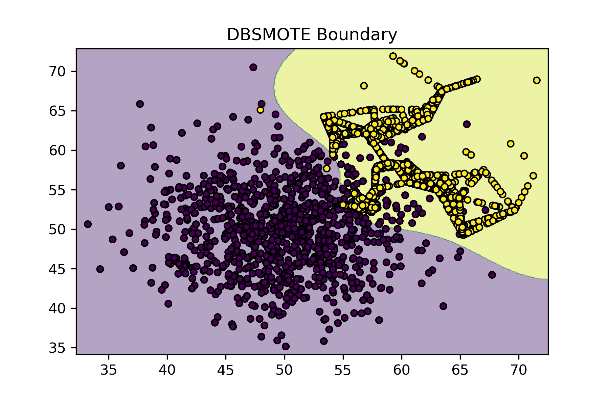
```
]


---
# Borderline-SMOTE

.pull-left[
```{r, echo = FALSE}
knitr::include_graphics("dbsmote_ori_db0.05.png")
```

|   Yellow Accuracy  |   Purple Accuracy  |      Balanced Accuracy  |
|-------------------:|-------------------:|---------------------:|
|               0.28 |              0.999 |                0.6395 |
]

.pull-right[
```{r, echo = FALSE}

```

|   Yellow Accuracy  |   Purple Accuracy  |      Balanced Accuracy  |
|-------------------:|-------------------:|---------------------:|
|               0.86 |              0.919 |                0.8895 |


]


---
# Kmean SMOTE

```{r, echo = FALSE}
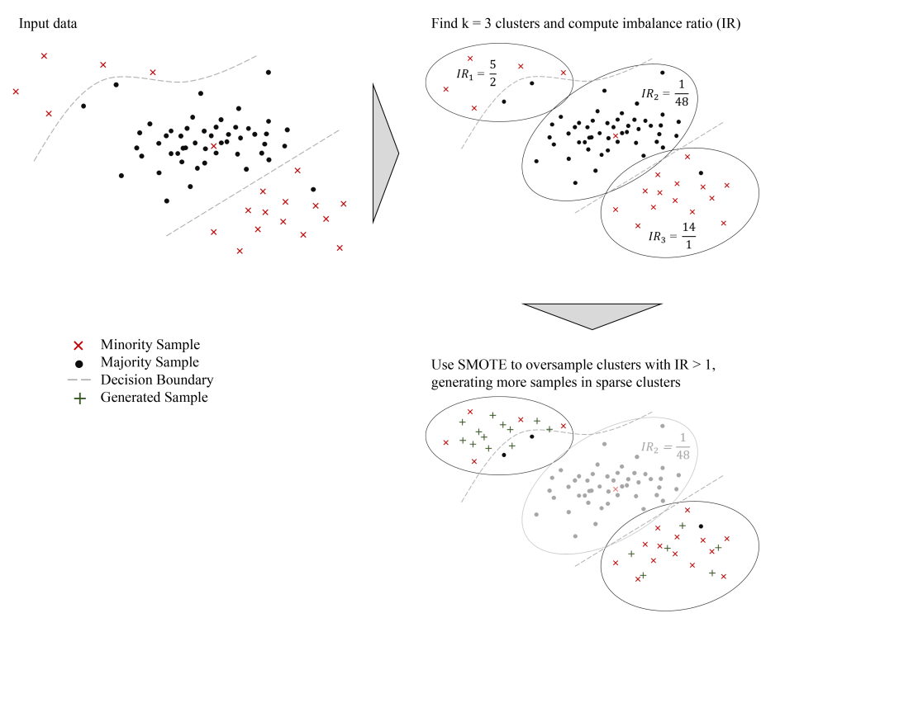
```

---
# Kmean-SMOTE

.pull-left[
```{r, echo = FALSE}

```

```{r, echo = FALSE}

```
]

.pull-right[

]

---
# Kmean-SMOTE

.pull-left[
```{r, echo = FALSE}

```

```{r, echo = FALSE}

```
]

.pull-right[
```{r, echo = FALSE}
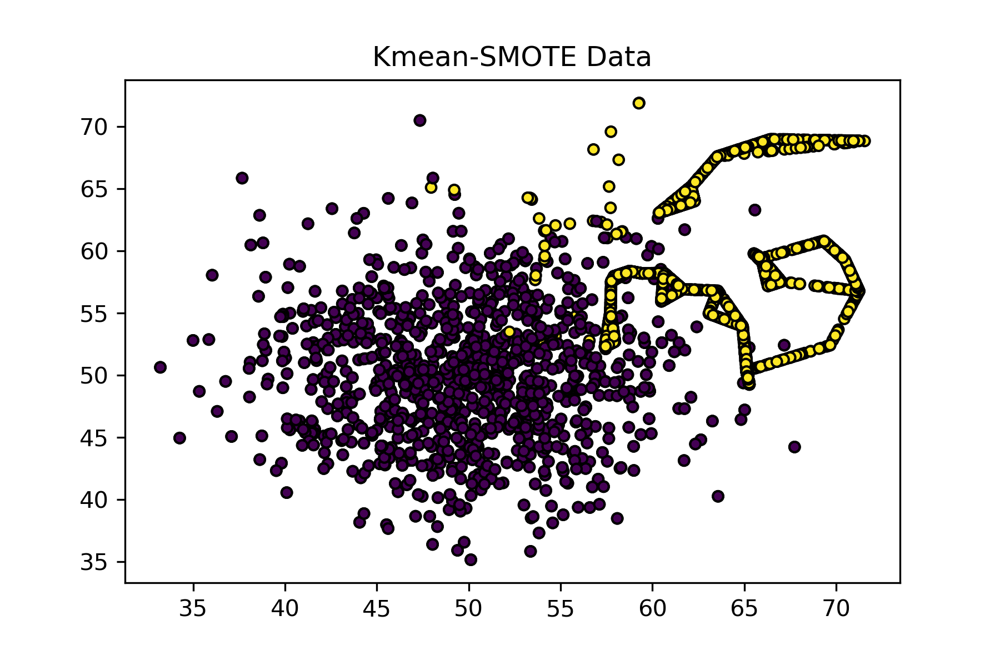
```


]

---
# Kmean-SMOTE

.pull-left[
```{r, echo = FALSE}

```

```{r, echo = FALSE}

```
]

.pull-right[
```{r, echo = FALSE}

```

```{r, echo = FALSE}
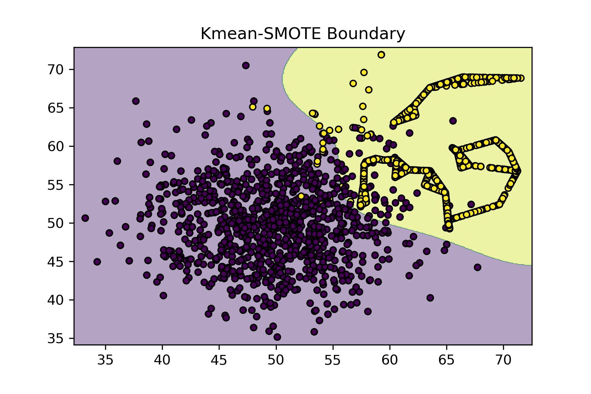
```
]


---
# Kmean-SMOTE Accuracy

.pull-left[
```{r, echo = FALSE}

```

|   Yellow Accuracy  |   Purple Accuracy  |      Balanced Accuracy  |
|-------------------:|-------------------:|---------------------:|
|               0.28 |              0.999 |                  0.6395 |
]

.pull-right[
```{r, echo = FALSE}

```

|   Yellow Accuracy  |   Purple Accuracy  |      Balanced Accuracy  |
|-------------------:|-------------------:|---------------------:|
|               0.82 |               0.94 |                    0.88 |


]


---
# Research Project: Data Oriented

- Find a dataset

- Propose a method

- Show that it works better than popular methods

---
# Research Project: Methodology Oriented

- Propose a method

- Find several datasets 

- Show that your method works better than popular methods on the datasets


---
# NEDSI 2021

- Northeast Decision Sciences Institute Conference 

- March 26-27, 2021 

- Abstract Submission:  January 16, 2021

---
# NEDSI in the past

.pull-left[
```{r, echo = FALSE}

```

]

.pull-right[
```{r, echo = FALSE}
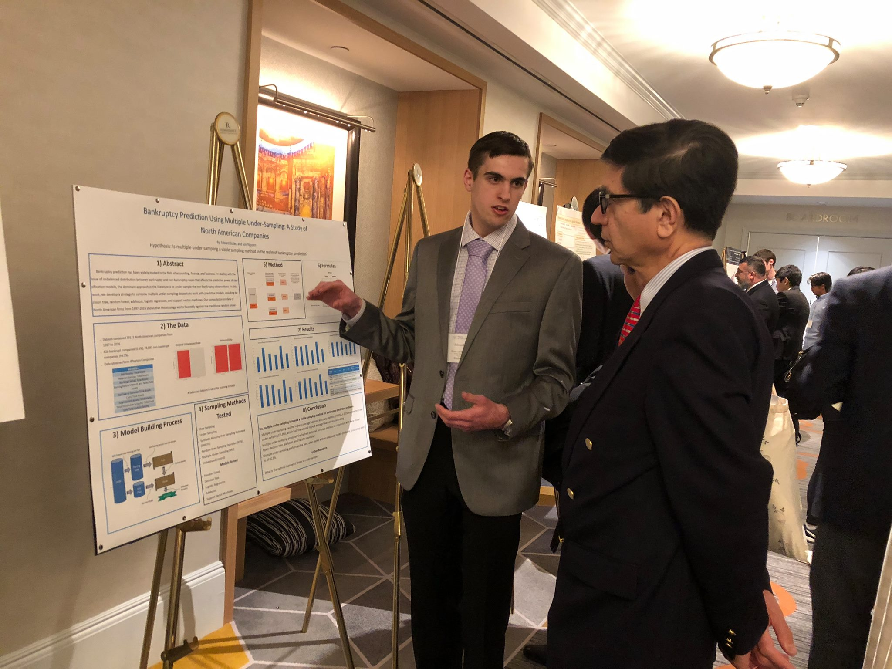
```


]

---
# NEDSI in the past

.pull-left[


```{r, echo = FALSE}
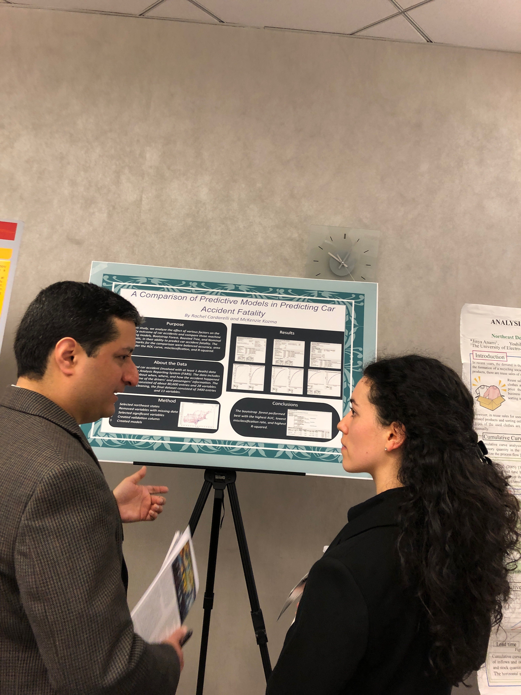
```
]

.pull-right[

```{r, echo = FALSE}
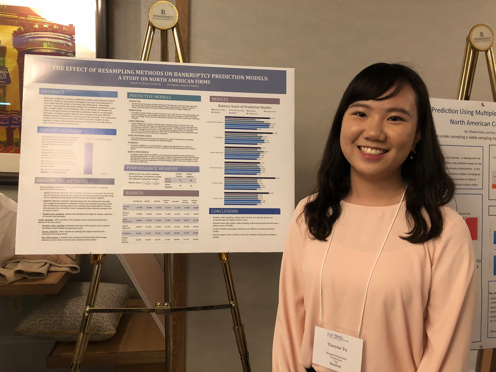
```
]


---
# NEDSI in the past

.pull-left[
```{r, echo = FALSE}
knitr::include_graphics("nedsi5.jpg")
```

]

.pull-right[
```{r, echo = FALSE}
knitr::include_graphics("nedsi6.jpg")
```

]


