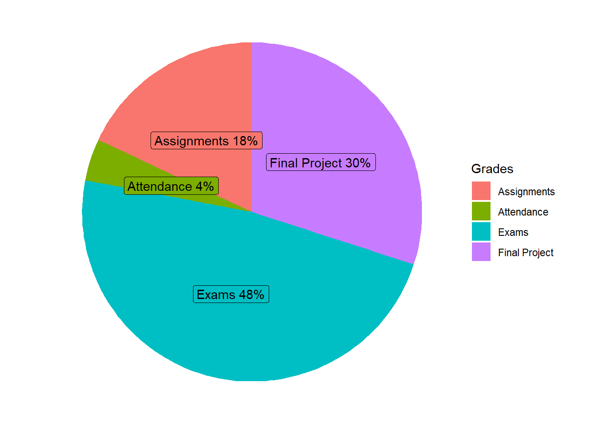

## Course Webpage

[Applied Data Mining](https://bryantstats.github.io/math460/)

## Course Description

This course provides extensive hands-on experience with SAS Enterprise Miner software and covers the basic skills required to assemble analyses using the rich tool set of both packages. It also covers concepts fundamental to understanding and successfully applying data mining methods.

## Course Objectives

After completing this course, you should be able to

- prepare data for analysis, including partitioning data and imputing missing values
- explain the algorithms of common predictive models such as decision trees,
regression models, and neural networks.
- train, assess, and compare multiple predictive models such as decision trees,
regression models, and neural networks.

## Office Hours:

You can find me at my office (A8 - Suite A) from 10:00AM-10:55PM on MWF. I am also available over Zoom (ID: 4419675207) during these times if needed. If these time slots do not work, please feel free to schedule another time with me.

## Grades

::: {.cell}
::: {.cell-output-display}
{width=672}
:::
:::

- *Final Project*: The final project offers you an opportunity to apply data mining techniques to an application. Projects can be done in teams of up to three students. If you have a project of such large scope and ambition that it cannot be done by a team of only three persons, you can propose doing a project in a team of four. The logistics and other details of the project will be updated on the course webpage and Canvas. 

- *Exams*: The exams are written exams. Calculators and a formula sheet are allowed. There will be practice problems for each exam to help you prepare for the exam. 

- *Assignments*: The assignments include, but not limited to, solving statistical problems, writing reports about a statistical technique, and presenting statistical analysis on a dataset.  

- *Attendance*: Attendance will be checked regularly in class. Missing fewer than four class meetings will guarantee you the full credits for attendance.  The grade for attendance (4%) is enough to move up a letter grade. You are responsible for obtaining course material missed during an absence. 

## Grades Scale

The numerical grades are converted to letter grades as follows.

|     |                |     |                |
|-----|----------------|-----|----------------|
| A   | 92.45 - 100%   | C   | 72.45 - 76.44% |
| A-  | 89.45 - 92.44% | C-  | 69.45 - 72.44% |
| B+  | 86.45 - 89.44% | D+  | 66.45 - 69.44% |
| B   | 82.45 - 86.44% | D   | 59.45 - 66.44% |
| B-  | 79.45 - 82.44% | F   | Below 59.44%   |
| C+  | 76.45 - 79.44% |     |                |

::: {.cell}
::: {.cell-output-display}
{width=672}
:::
:::

## Late Work  

Late assignments are penalized 10% for each day late. You can resubmit your work to improve your score, but the late penalty will apply.  

## Tentative Topics

- Overfitting and Model Tuning
- Classification Tree
- Random Forest
- Adaboost and Boosting Algorithm
- Gradient Boosting
- K-Nearest Neighbors
- Recommendation System
- ElasticNet
- Variable selection
- Neural Network and Deep Learning 

## Academic Misconduct

Cheating will result in an "F" as your final grade and may result in your expulsion from the University. All cheating will be reported to the Chair of the Mathematics Department and Academic Advising.

## Regarding Diversity

In this course, and all your courses at Bryant, and throughout the Bryant learning community, we value and respect diversity. This includes differences in race, ethnicity, nationality, gender, gender identity, sexuality, socioeconomic status, ability, and religion.

