

Classification Trees
========================================================
author: Son Nguyen
font-family: Garamond

Reading Materials
=======================================================
- Max Kuhn. Chapter 14. Section 14.1 

Decision Boundary in Classification
=======================================================

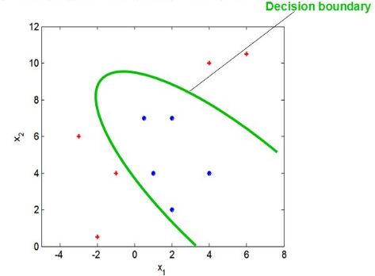

Classification is a process of finding the **decision boundary** that best separate two classes

Decision Boundary in Classification
=======================================================

SVM = Support Vector Machine

Decision Tree
=======================================================
- Decision Tree for classification is **Classification Tree**
- Decision Tree for Regression is **Regression Tree**

Example of Classification Tree
=======================================================

[Link] (http://graphics8.nytimes.com/images/2008/04/16/us/0416-nat-subOBAMA.jpg)

Example of Classification Tree
=======================================================

Example of Classification Tree
=======================================================

Classification Tree
=======================================================

- In two dimension, classification Tree's decision boundary is a collection of horiontal and vertical line

Data
=======================================================

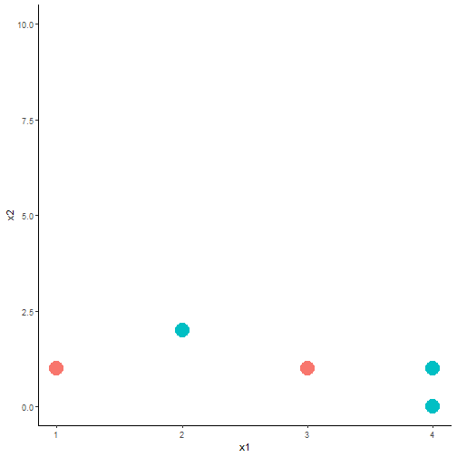

- The tree starts by a vertical or horizontal line that **best** seperate the data
- **Question**: Find a vertical line that best seperate **red** and **green**. 

One way to seperate the reds and greens
=======================================================

One way to seperate the reds and greens
=======================================================

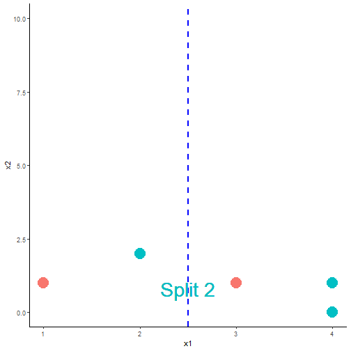

One way to seperate the reds and greens
=======================================================

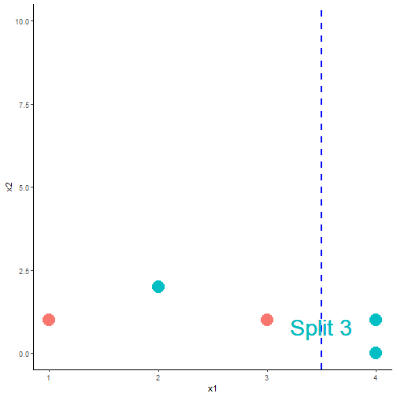

Question
=======================================================
- **Question**: Which is the best split? 

Partial Answer
=======================================================
- It looks like Split 1 and 3 are better than Split 2 since it misclassifies less
- Which is the better split between Split 1 and Split 3?
- We need to find a way to measure *how good a split is*

Impurity Measure
=======================================================
- The impurity of a node (__a node = a subset of the data or the original data__) measure how uncertain the node is.  
- For example, node A with 50% reds and 50% greens would be more uncertained than node B with 90% reds and 10% greens. Thus, node A has greater impurity than node B. 
- More uncertained $=$ Greater impurity

Impurity Measure
=======================================================
- A split that *gains* more impurity is the **better split**!

Impurity Gain
=======================================================

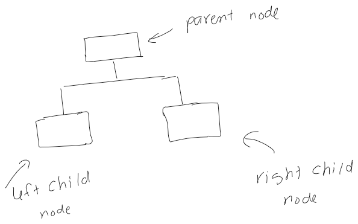

$$
IG = I_{parent} - \frac{N_{left}}{N}I_{left}-\frac{N_{right}}{N}I_{right}
$$

- IG is Impurity Gain of the split
- $N_{left}$ and $N_{right}$ are the number of points in the left child node and right child node, respectively. 
- $N_{left}+N_{right}=N$

Impurity Measure
=======================================================
- Impurity can be measured by: classification error, Gini Index, and Entropy. 

Impurity Measure
=======================================================
- Let $p_0$ and $p_1$ be the proportion of class 0 and class 1 in a node.  

$$
\begin{aligned}
{\text{By Classification Error: }} I &= min\{p_0, p_1\} \\
{\text{By Gini Index: }} I&= 1 - p_0^2-p_1^2 \\
{\text{By Entropy: }} I &= -p_0 \log_2(p_0)-p_1\log_2(p_1) 

\end{aligned}
$$

Calculation
=======================================================
- Let's calculate the impurity gain of the three splits to decide which split is the best

IG By Classification Error
=======================================================
- Let **green** and **red** be class 0 and class 1, respectively.

For Split 1:  $N = 5, N_{left} =1, N_{right} = 4$

- Node *parent,* A:  $p_0 = \frac{2}{5}, p_1 = \frac{3}{5}$.  Thus, $I_{A} = \text{min}(\frac{2}{5}, \frac{3}{5}) = \frac{2}{5}$

- Node *child left,* L:  $p_0 = \frac{0}{1} = 0, p_1 = \frac{1}{1} = 1$.  Thus, $I_{L} = \text{min}(0, 1) = 0$

- Node *child right,* R:  $p_0 = \frac{3}{4}, p_1 = \frac{1}{4}$.  Thus, $I_{R} = \text{min}(\frac{3}{4}, \frac{1}{4}) = \frac{1}{4}$

- Impurity Gain of Split 1: 

$$IG = \frac{2}{5} - \frac{1}{5} \cdot 0-\frac{4}{5} \cdot \frac{1}{4} = 0.2$$

IG By Classification Error
=======================================================
For Split 2:  $N = 5, N_{left} =2, N_{right} = 3$

- Node *parent,* A:  $p_0 = \frac{2}{5}, p_1 = \frac{3}{5}$.  Thus, $I_{A} = \text{min}(\frac{2}{5}, \frac{3}{5}) = \frac{2}{5}$

- Node *child left,* L:  $p_0 = \frac{1}{2}, p_1 = \frac{1}{2}$.  Thus, $I_{L} = \frac{1}{2}$

- Node *child right,* R:  $p_0 = \frac{2}{3}, p_1 = \frac{1}{3}$.  Thus, $I_{R} = \text{min}(\frac{2}{3}, \frac{1}{3}) = \frac{1}{3}$

- Impurity Gain of Split 2: 

$$IG = \frac{2}{5} - \frac{2}{5} \cdot \frac{1}{2}-\frac{3}{5} \cdot \frac{1}{3} = 0$$

IG By Classification Error
=======================================================
For Split 3:  $N = 5, N_{left} =3, N_{right} = 2$

- Node *parent,* A:  $p_0 = \frac{2}{5}, p_1 = \frac{3}{5}$.  Thus, $I_{A} = \text{min}(\frac{2}{5}, \frac{3}{5}) = \frac{2}{5}$

- Node *child left,* L:  $p_0 = \frac{1}{3}, p_1 = \frac{2}{3}$.  Thus, $I_{A} = \text{min}(\frac{1}{3}, \frac{2}{3}) = \frac{1}{3}$

- Node *child right,* R:  $p_0 = \frac{2}{2}, p_1 = \frac{0}{2}$.  Thus, $I_{R} = \text{min}(1,0) = 0$

- Impurity Gain of Split 3: 

$$IG = \frac{2}{5} - \frac{3}{5} \cdot \frac{1}{3}-\frac{2}{5} \cdot 0 = 0.2$$

Comparing IG By Classification Error
=======================================================

|         | IG        |
|---------|-----------|
| Split 1 | 0.2 |
| Split 2 | 0 |
| Split 3 | 0.2          |

- By classification error, Split 1 and Split 3 are tie as the best because they have the same impurity gain. 

IG By Gini Index
=======================================================
For Split 1:  $N = 5, N_{left} =1, N_{right} = 4$

- Node *parent,* A:  $p_0 = \frac{2}{5}, p_1 = \frac{3}{5}$.  Thus, $I_{A} = 1 - (\frac{2}{5})^2-(\frac{3}{5})^2 = 0.48$

- Node *child left,* L:  $p_0 = \frac{0}{1} = 0, p_1 = \frac{1}{1} = 1$.  Thus, $$I_{L} = 1 -0^2-1^2 = 0$$

- Node *child right,* R:  $p_0 = \frac{3}{4}, p_1 = \frac{1}{4}$.  Thus, $$I_{R} = 1-(\frac{3}{4})^2-(\frac{1}{4})^2 = 0.375$$

- Impurity Gain of Split 1: 

$$IG = 0.48 - \frac{1}{5} \cdot 0-\frac{4}{5} \cdot 0.375 = 0.18$$

IG By Gini Index
=======================================================
For Split 2:  $N = 5, N_{left} =2, N_{right} = 3$

- Node *parent,* A:  $p_0 = \frac{2}{5}, p_1 = \frac{3}{5}$.  Thus, $I_{A} = 1-(\frac{2}{5})^2- (\frac{3}{5})^2 = 0.48$

- Node *child left,* L:  $p_0 = \frac{1}{2}, p_1 = \frac{1}{2}$.  Thus, $I_{L} = 1- (\frac{1}{2})^2-(\frac{1}{2})^2=0.5$

- Node *child right,* R:  $p_0 = \frac{2}{3}, p_1 = \frac{1}{3}$.  Thus, $I_{R} = 1-(\frac{2}{3})^2 -(\frac{1}{3})^2 = 0.44$

- Impurity Gain of Split 2: 

$$IG = 0.48 - \frac{2}{5} \cdot \frac{1}{2}-\frac{3}{5} \cdot 0.44 = 0.016$$

IG By Gini Index
=======================================================
For Split 3:  $N = 5, N_{left} =3, N_{right} = 2$

- Node *parent,* A:  $I_{A} = 0.48$

- Node *child left,* L:  $p_0 = \frac{1}{3}, p_1 = \frac{2}{3}$.  Thus, $I_{A} = 1-(\frac{1}{3})^2 -(\frac{2}{3})^2 = 0.44$

- Node *child right,* R:  $p_0 = \frac{2}{2}, p_1 = \frac{0}{2}$.  Thus, $I_{R} = 1-0^2-1^2 = 0$

- Impurity Gain of Split 3: 

$$IG = 0.48 - \frac{3}{5} \cdot 0.44 - \frac{2}{5} \cdot 0 = 0.216$$

Comparing IG By Gini Index
=======================================================

|         | IG        |
|---------|-----------|
| Split 1 | 0.18 |
| Split 2 | 0.016 |
| Split 3 | 0.216          |

- By Gini Index, Split 3 is the best because it has the greatest impurity gain. 

IG By Entropy
=======================================================
For Split 1:  $N = 5, N_{left} =1, N_{right} = 4$

- Node *parent,* A:  $p_0 = \frac{2}{5}, p_1 = \frac{3}{5}$.  Thus, $I_{A} = - log_2(\frac{2}{5})-log_2(\frac{3}{5}) = 0.971$

- Node *child left,* L:  $p_0 = \frac{0}{1} = 0, p_1 = \frac{1}{1} = 1$.  Thus, $I_{L} = 0$

- Node *child right,* R:  $p_0 = \frac{3}{4}, p_1 = \frac{1}{4}$.  Thus, $$I_{R} = -\frac{3}{4} \cdot log_2(\frac{3}{4})-\frac{1}{4} \cdot log_2(\frac{1}{4}) = 0.811$$

- Impurity Gain of Split 1: 

$$IG = 0.971 - \frac{1}{5} \cdot 0-\frac{4}{5} \cdot 0.811 = 0.322$$

IG By Entropy
=======================================================
For Split 2:  $N = 5, N_{left} =2, N_{right} = 3$

- Node *parent,* A:  $p_0 = \frac{2}{5}, p_1 = \frac{3}{5}$.  Thus, $I_{A} = 0.971$

- Node *child left,* L:  $p_0 = \frac{1}{2}, p_1 = \frac{1}{2}$.  Thus, $I_{L} = - log_1(\frac{1}{2})-log_2(\frac{1}{2})=1$

- Node *child right,* R:  $p_0 = \frac{2}{3}, p_1 = \frac{1}{3}$.  Thus, $I_{R} = -\frac{2}{3} \cdot log_2(\frac{2}{3}) -\frac{1}{3} \cdot log_2(\frac{1}{3}) = 0.918$

- Impurity Gain of Split 2: 

$$IG = 0.971 - \frac{2}{5} \cdot 1-\frac{3}{5} \cdot 0.918 = 0.02$$

IG By Entropy
=======================================================
For Split 3:  $N = 5, N_{left} =3, N_{right} = 2$

- Node *parent,* A:  $I_{A} = 0.971$

- Node *child left,* L:  $p_0 = \frac{1}{3}, p_1 = \frac{2}{3}$.  Thus, $I_{A} = -log_2(\frac{1}{3}) -log_2(\frac{2}{3}) = 0.918$

- Node *child right,* R:  $p_0 = \frac{2}{2}, p_1 = \frac{0}{2}$.  Thus, $I_{R} = 0$

- Impurity Gain of Split 3: 

$$IG = 0.971 - \frac{3}{5} \cdot 0.918 - \frac{2}{5} \cdot 0 = 0.42$$

Comparing IG By Entropy
=======================================================

|         | IG        |
|---------|-----------|
| Split 1 | 0.322 |
| Split 2 | 0.02 |
| Split 3 | 0.42          |

- By Gini Index, Split 3 is the best because it has the greatest impurity gain. 

Comparing Impurity Measures
=======================================================

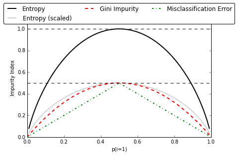
- Relation between impurity and the class probabilities. All impurity measures are maximized at **$p_1 =1/2$** and minimized at **$p_1 = 0$** and **$p_1=1$**.  

Another Example
=======================================================

- Which split is better?

<!-- By Classification Error  -->
<!-- ======================================================= -->

<!-- 
 -->
<!--  -->
<!-- 
 -->

<!-- - No split is better! They both have the same impurity gain.  -->

<!-- By Gini Index  -->
<!-- ======================================================= -->

<!-- 
 -->
<!-- 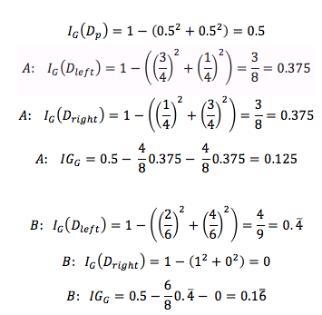 -->
<!-- 
 -->

<!-- - Split B is better because it provides greater impurity gain! -->

<!-- By Entropy -->
<!-- ======================================================= -->

<!-- 
 -->
<!-- 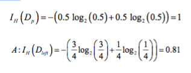  -->

<!-- 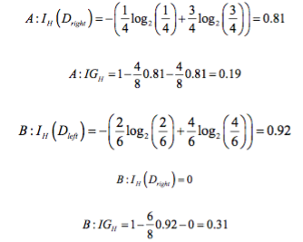 -->
<!-- 
 -->
<!-- - Split B is better because it provides greater impurity gain! -->

Decide the best split using Chi-Square test of Independence
=======================================================
- Besides impurity gain, one can use the Chi-square, $\chi^2$, test of independence to decide the best split. 

Review of Chi-Square test of Independence
=======================================================
- Let $X$ and $Y$ be two categorical variables. 
- We want to test if $X$ and $Y$ are independent/associated
  - $H_0$: $X$ and $Y$ are independent
  - $H_{\alpha}:$ $X$ and $Y$ are dependent 

- Test statistic: 

$$\sum\frac{(e_i-o_i)^2}{e_i} \sim \chi^2 \text{ distribution with degree of freedom} (n-1)(m-1)$$

Review of Chi-Square test of Independence
=======================================================
- In our context, the greater the $\chi^2$ value, the smaller the $p-value$
- The smaller the $p-value$, the more dependent the two variables are. Thus the better the split is. 
- Therefore, we look for the split with the **greatest $\chi^2$ value.** 

Applying to Our Example
=======================================================
- We will calculate the $\chi^2$ values of the three splits.  
- The best split is the split with the greatest $\chi^2$ value. 

Split 1
=======================================================

|              | Greens | Reds |   |
|--------------|--------|------|---|
| Left Branch  | 0 (Cell 1)     | 1 (Cell 2)    | 1 |
| Right Branch | 3  (Cell 3)    | 1  (Cell 4)   | 4 |
|              | 3      | 2    |   |

$$\chi^2 = \frac{(e_1-o_1)^2}{e_1}+\frac{(e_2-o_2)^2}{e_2}+\frac{(e_3-o_3)^2}{e_3}+\frac{(e_4-o_4)^2}{e_4}$$

- $i=1$ (Cell 1): $e_1 = \frac{1\cdot 3}{5}$, $o_1 = 0$
- $i=2$ (Cell 2): $e_2 = \frac{1\cdot 2}{5}$, $o_2 = 1$
- $i=3$ (Cell 3): $e_3 = \frac{3\cdot 4}{5}$, $o_3 = 3$
- $i=4$ (Cell 4): $e_4 = \frac{2\cdot 4}{5}$, $o_4 = 1$

- Plug in, we have: 
$$\chi^2 = 1.875$$

Split 2
=======================================================

|              | Greens | Reds |   |
|--------------|--------|------|---|
| Left Branch  | 1 (Cell 1)     | 1 (Cell 2)    | 2 |
| Right Branch | 2  (Cell 3)    | 1  (Cell 4)   | 3 |
|              | 3      | 2    |   |

$$\chi^2 = \frac{(e_1-o_1)^2}{e_1}+\frac{(e_2-o_2)^2}{e_2}+\frac{(e_3-o_3)^2}{e_3}+\frac{(e_4-o_4)^2}{e_4}$$

- $i=1$ (Cell 1): $e_1 = \frac{2\cdot 3}{5}$, $o_1 = 1$
- $i=2$ (Cell 2): $e_2 = \frac{2\cdot 2}{5}$, $o_2 = 1$
- $i=3$ (Cell 3): $e_3 = \frac{3\cdot 3}{5}$, $o_3 = 2$
- $i=4$ (Cell 4): $e_4 = \frac{3\cdot 2}{5}$, $o_4 = 1$

- Plug in, we have: 
$$\chi^2 = 0.139$$

Split 3
=======================================================

|              | Greens | Reds |   |
|--------------|--------|------|---|
| Left Branch  | 1 (Cell 1)     | 2 (Cell 2)    | 3 |
| Right Branch | 2  (Cell 3)    | 0  (Cell 4)   | 2 |
|              | 3      | 2    |   |

$$\chi^2 = \frac{(e_1-o_1)^2}{e_1}+\frac{(e_2-o_2)^2}{e_2}+\frac{(e_3-o_3)^2}{e_3}+\frac{(e_4-o_4)^2}{e_4}$$

-  (Cell 1): $e_1 = \frac{2\cdot 3}{5}$, $o_1 = 1$
-  (Cell 2): $e_2 = \frac{2\cdot 2}{5}$, $o_2 = 2$
-  (Cell 3): $e_3 = \frac{3\cdot 3}{5}$, $o_3 = 2$
-  (Cell 4): $e_4 = \frac{3\cdot 2}{5}$, $o_4 = 0$

- Plug in, we have: 
$$\chi^2 = 2.222$$

Comparing the three splits
=======================================================

|         | $\chi^2$        |
|---------|-----------|
| Split 1 | 1.875 |
| Split 2 | 0.139 |
| Split 3 | 2.222          |

- Split 3 is the best because it has the greatest $\chi^2$!

Logworth
=======================================================
- The quality of the split can be measured by **Logworth**
- Formula: $$logworth = -log(p\text{_}value)$$
- The greater the logworth, the better the split

Logworth
=======================================================

|         | $\chi^2$        |p-value|logworth|
|---------|-----------|-----------|-----------|
| Split 1 | 1.875 |0.114|0.943|
| Split 2 | 0.139 |0.998|0.0008
| Split 3 | 2.222   | 0.088    |  1.055|

- Greatest $\chi^2$ = Lowest $p-value$ = Greatest logworth = Best Split

- Split 3 is the best split!

What happens after the first split?
=======================================================
- After the first split, the data are divided into to subsets.
- The splitting process is repeated for each subset. 
- The process ends when a stopping criteria is satisfied

Stopping Criteria
=======================================================
- Minimum Leaf Size: The minimum of observations in the leaves
- Maximum Number of Leaves
- Maximum Depth
- Others

Stopping Criteria
=======================================================

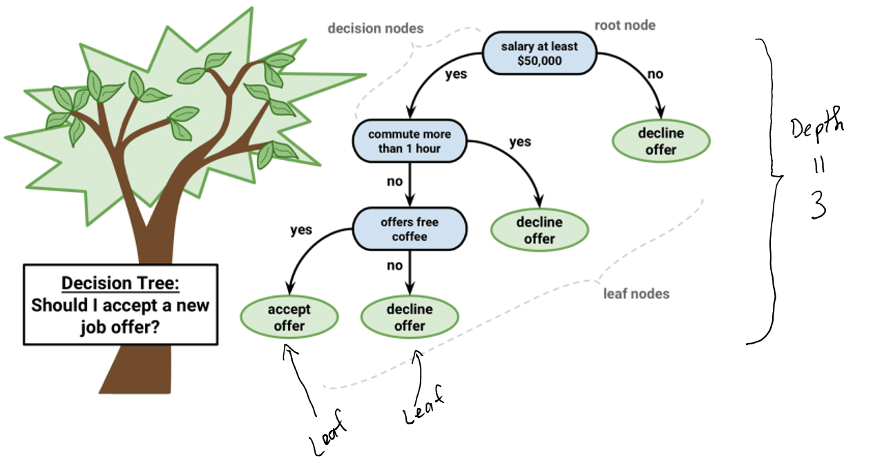 

Decision Tree Algorithm - How to grow a tree
=======================================================
- Step 1: Calculate the impurity gain or $p-value$ of all possible splits at all variables
- Step 2: Select the split that give the maximum impurity gain or lowest $p-value$ to split the data into two subdata $D_1$ and $D_2$
- Repeat *Step 1* and *Step 2* to both $D_1$ and $D_2$. 
- Until a stopping criteria is satisfied

Complexity of Decision Tree
=======================================================
- A complexity of a tree can be measured by the number of leaves the tree has
- The more leaves a tree has, the more complex the tree is.
- A complex tree may be **overfitted**, i.e. having low training error but high testing error. 

Prunning a tree
=======================================================
- For any given data, one can construct a tree that achives 0 misclassification on training data
- After growing the tree one needs to prune it to avoid overfittted

Prunning a tree
=======================================================
- The tree with maximum number of leaves is called the **maximal tree** (still satisfied the stopping rule)
- From the **maximal tree**, leaves are cut down, one by one, to obatined all possible subtrees
- The subtree with lowest error on validation data, is the **optimal tree** 

Maximal vs Optimal Tree
=======================================================

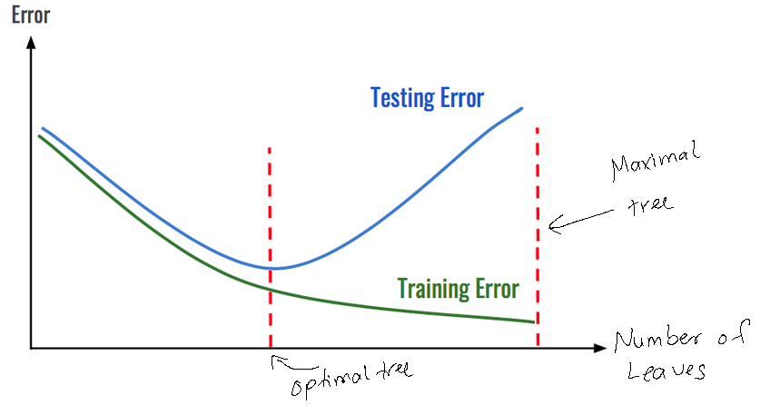 

Example of Tree Prunning
=======================================================

 

Example of Tree Prunning
=======================================================

 
- All the subtrees A, B, C, D, and E will be validated with the validation data to find the **optimal tree**
- The **optimal tree** could be the **maximal tree**! 

Question
=======================================================

 
- What if both B and C give the lowest error on the validation data? Which tree should be selected as the final model?

