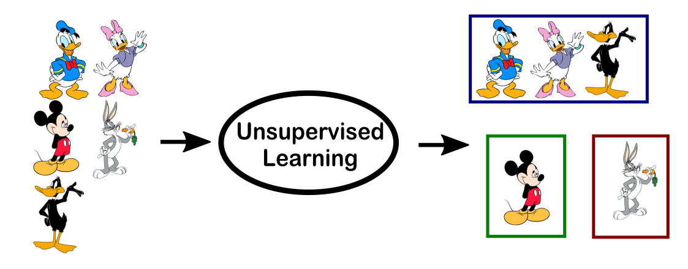

```{r setup, include=FALSE}
options(htmltools.dir.version = FALSE)
```

```{r xaringan-tile-view, echo=FALSE}
xaringanExtra::use_tile_view()
```


```{r xaringan-panelset, echo=FALSE}
xaringanExtra::use_panelset()
```

```{r, echo=FALSE}
xaringanExtra::use_webcam()
```

```{r xaringan-fit-screen, echo=FALSE}
xaringanExtra::use_fit_screen()
```


# What is Data Mining?

- Data Mining can be defined as the process that starting from apparently unstructured data tries to extract knowledge and/or unknown interesting patterns.

- During this process **Machine Learning algorithms** are used.

---
# Data Mining vs. Machine Learning

- What are the differences?

- The short answer is:  **None.** 

- "They are concerned with the same question:  how do we learn from data?" - Wasserman. 

- Read more:  [What's the difference between machine learning, statistics, and data mining?](https://www.r-bloggers.com/whats-the-difference-between-machine-learning-statistics-and-data-mining/)

---
# Machine learning Algorithms

- Machine Learning relates with the study, design and development of the algorithms that give computers the capability to **learn** without being **explicitly** programmed

---
class: inverse, center, middle

# Explicit vs. Implicit Programming


---
# Explicit vs. Implicit Programming

- **Problem**:  Solve by a quadratic equation using computer. 
  - Input: A quadratic Equation
  - Output: Its solutions

$$
ax^2+bx+c = 0
$$
  

- **Explicit** approach: using the quadratic formula 

$$
x = \frac{-b \pm \sqrt{b^2-4ac}}{2a}
$$

- **Implicit** approach:  
  - Collect data:  Find 1000 (or more!) quadratic equations with solutions.
  - Train models:  Train multiple models to "learn" the relationship between the 100 equations and their solutions
  - Validate model: Test the trained model to select the **best** model to use
  - Use the best model "predict" the solutions of a given equation

---
# Explicit vs. Implicit Programming

- ML approach needs data; explicit programming approach does not.

- Machine:  Without data, there is no learning!

- Human: Without experience, there is no learning!  

---
# Different types of Learning

- **Supervised learning**: We use supervised learning algorithms when we want to *predict* something from the data.  

- **Unsupervised learning**: We use unsupervised learning algorithms when we want to understand the structure of the data.

---
class: inverse, center, middle

# Supervised vs. Unsupervised

---
# Supervised Learning


---
# Supervised Learning


---
# Supervised Learning


---
# Unsupervised Learning


---
# Unsupervised Learning


---



---


---


Also **Unsupervised Learning**

---
# Supervised vs. Unsupervised

- **Supervised learning** requires **labels**


---
# Supervised vs. Unsupervised

- **Supervised learning** requires **labels**
- There are **training** data and **testing** data in supervised learning. 


---
# Supervised vs. Unsupervised

- **Supervised learning** requires **labels**
- There are **training** data and **testing** data in supervised learning. 
- We can measure the **accuracy** of supervised learning algorithm. 

---
class: inverse, center, middle

# Applications of Supervised learning

---
- Face recognition (tagging names on faces): Facebook.


---


---


---


---

- Pneumonia Detection https://stanfordmlgroup.github.io/projects/chexnet/

- Improving Palliative Care https://stanfordmlgroup.github.io/projects/improving-palliative-care/

- Face Detection (Apple): https://machinelearning.apple.com/2017/11/16/face-detection.html

