

K-Nearest Neighbor (KNN)
========================================================
author: Son Nguyen
font-family: Garamond
transition: none

=======================================================

=======================================================

Example
=======================================================
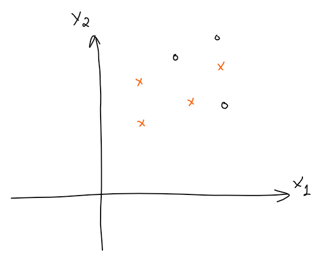
- Given the training data

Example
=======================================================
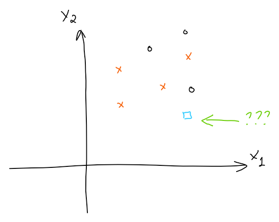
- Predict the new sample

Example
=======================================================
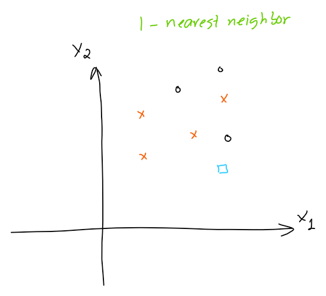
- "You are as good as your best (closest) friend!"

Example
=======================================================

Example
=======================================================
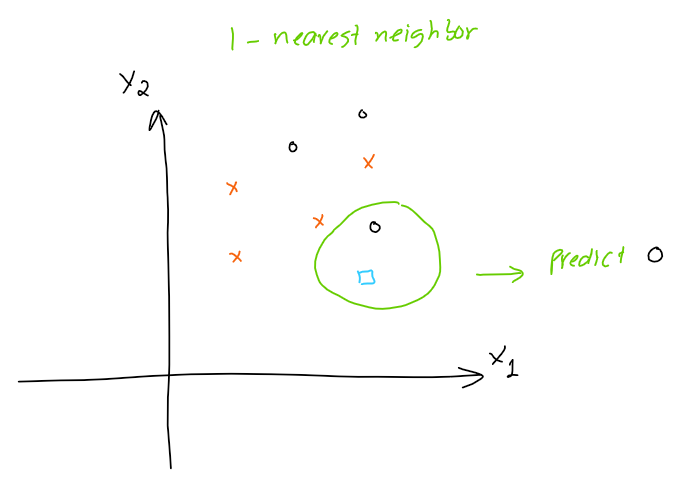
- 1NN model would classify the new sample as $o$ since the nearest neighbor is $o$

Example
=======================================================
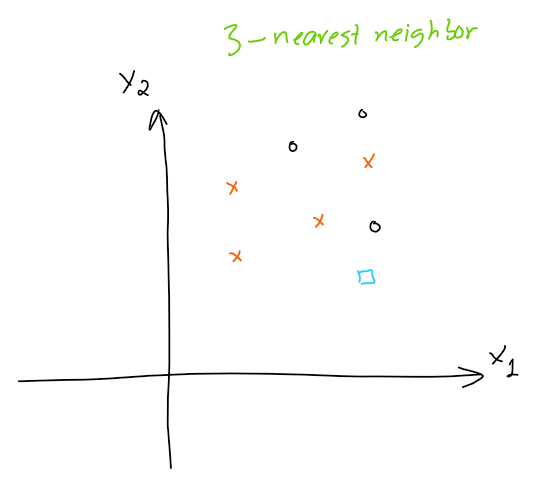

Example
=======================================================
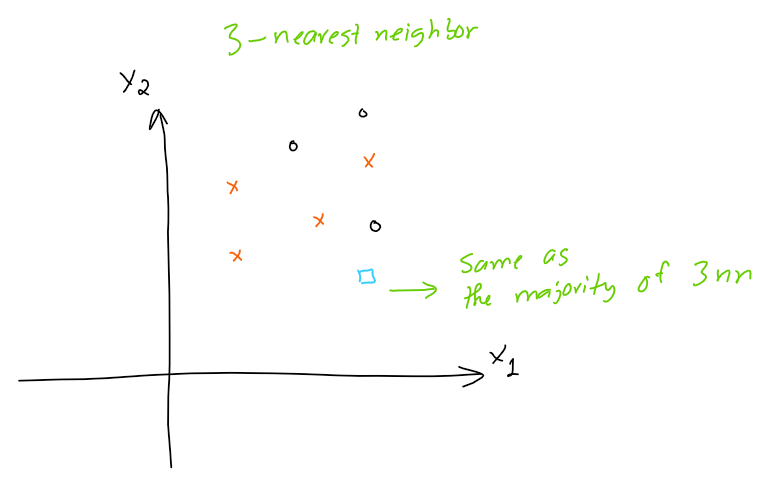

Example
=======================================================
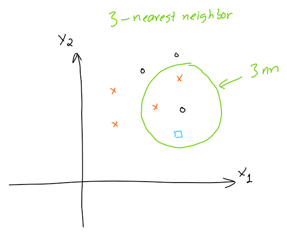

Example
=======================================================
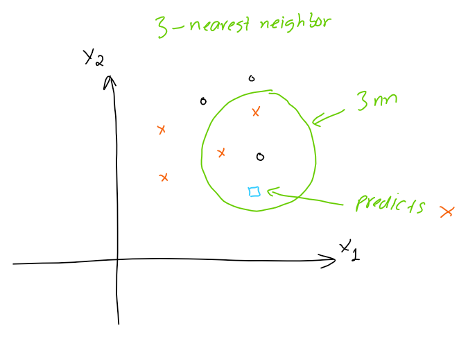
- 3NN model would classify the new sample as $x$ since the majorty of the nearest neighbors is $x$

KNN Algorithm
=======================================================
- **Prediction Rule**: Look at the K most similar training examples
- For **classification**: assign the *majority* class label (majority voting)
- For **regression**: assign the *average* response

KNN Algorithm
=======================================================

- **Step 1**: Standardize the variables

- **Step 2**: Compute the test point's distance from each training point

- **Step 3**: Sort the distances in ascending (or descending) order

- **Step 4**: Use the sorted distances to select the K nearest neighbors

- **Step 5**: Use majority rule (for classification) or averaging (for regression)

Algorithm Requirements
=======================================================
- The algorithm requires:

  - **Tuning Parameter K**: number of nearest neighbors to look for
  - **Distance function**: To compute the similarities between examples
  
Distances 
=======================================================
- The K-NN algorithm requires computing distances of the test example from each of the training examples
- Several ways to compute distances
- The choice depends on the type of the variables in the data

Distances 
=======================================================

- **Euclidean distance** is commonly used when there are continious variables

$$
d (u, v) = \sqrt{(u_1-v_1)^2 + (u_1-v_1)^2+...+(u_n-v_n)^2},
$$
where $$ u = [u_1, u_2,...,u_n]$$ and $$v = [v_1, v_2,...,v_n]$$

- **Hamming distance**  is commonly used when there are categorical variables: $d(u, v)$ = Number of times $u$ and $v$ are different. 

Distance Example
=======================================================

|            | Sex    | Age     | Class |
|------------|--------|---------|-------|
| u          | Male   | 27      | A     |
| v          | Famale | 30      | A     |
| Difference | 1      | 3 | 0     |

 $$d(u, v) = \sqrt{1^2+3^2+0^2} = \sqrt{10}$$
 
 - Notice:  Usually the **Age** variable needs to be standardized to have the range from 0 to 1 before calculating the distance. 

Why standardizing the variables?
=======================================================
Considering the following data: 

|   | Age | Salary ($1000) |
|---|-----|----------------|
| A | 15  | 90             |
| B | 30  | 80             |
| C | 80  | 87             |

We have $$AB = d(A, B) = \sqrt{(30-15)^2+(80-90)^2} = 18.03$$
$$AC = d(A, C) = \sqrt{(80-15)^2+(87-90)^2} = 65.07$$

Thus, $$ AB < AC $$

However, with the **same** data

|   | Age | Salary ($) |
|---|-----|----------------|
| A | 15  | 90,000             |
| B | 30  | 89,000             |
| C | 80  | 87,000             |

We have $$AB = d(A, B) = \sqrt{(30-15)^2+(80,000-90,000)^2} = 10,000.01$$
$$AC = d(A, C) = \sqrt{(80-15)^2+(87,000-90,000)^2} = 3000.70$$

Thus, $$ AB > AC $$

Not good! 

Why standardizing the variables?
=======================================================

- Distances are affected by scaler-multiplication. Hence, the units of the variables will affect the distances. 

- Standardizing variables will cancel this effect. 

Why standardizing the variables?
=======================================================

- Common practice: Standardize variables to have the range from 0 to 1: 

$$
\text{Standardized} X = \frac{X-X_{min}}{X_{max}-X_{min}}
$$

Standardize the previous data (in either unit for salary): 

|   | Age | Salary ($1000) |
|---|-----|----------------|
| A | 0  | 1             |
| B | 0.23  | 0.7             |
| C | 1  |       0       |

We have $$AB = d(A, B) = \sqrt{(0-.23)^2+(1-.7)^2} = 0.38$$
$$AC = d(A, C) = \sqrt{(0-1)^2+(1-0)^2} = 1.41$$.

Thus, we always have: $$ AB < AC $$

Choice of K - Neighborhood Size
=======================================================

- **Question**: Does larger or smaller $K$ tend to overfit the model? 

Choice of K - Neighborhood Size
=======================================================

- **Question**: Does larger or smaller $K$ tend to overfit the model? 
- **Hint**: Which one performs better on the training data?

Choice of K - Neighborhood Size
=======================================================

- Small K
  - Creates many small regions for each class
  - May lead to non-smooth decision boundaries and **overfit**

- Large K
  - Creates fewer larger regions
  - Usually leads to smoother decision boundaries (caution: too smooth decision boundary can **underfit**)
  
Weights in KNN
=======================================================
- If $A$, $B$, $C$ are three nearest neighbors of $D$, then the predicted probability of the $D$ by **3NN** is given by

$$
\text{Predicted Probability of D} = \frac{w_A \cdot y_A + w_B \cdot y_B +w_C\cdot y_C}  {w_A+w_B+w_c}
$$

Weights in KNN
=======================================================

- **Uniform Weights**: All points in each neighborhood are weighted equally when predicting.

- If $A$, $B$, $C$ are three nearest neighbors of $D$, then the predicted probability of the $D$ by **3NN** with uniform **weights**
becomes: 

$$
\text{Predicted Probability of D} = \frac{y_A + y_B +y_C}  {3}
$$

- Uniform weights are the default weights when using KNN

Weights in KNN
=======================================================

- **Distance Weights**  weight points by the *inverse* of their distance. in this case, closer neighbors of a query point will have a greater influence than neighbors which are further away. 

- If $A$, $B$, $C$ are three nearest neighbors of $D$, then the predicted probability of the $D$ by **3NN** with **distance weights**
is: 

$$
\text{Predicted Probability of D} = \frac{\frac{1}{DA} \cdot y_A + \frac{1}{DB} \cdot y_B +\frac{1}{DC}\cdot y_C}  {\frac{1}{DA}+\frac{1}{DB}+\frac{1}{DC}}
$$

Weights in KNN
=======================================================

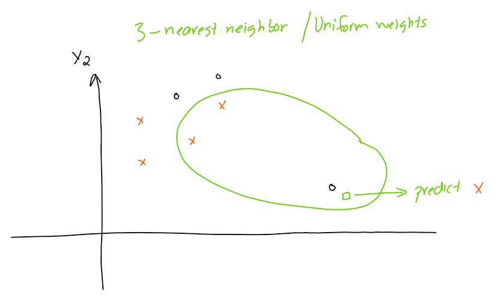

- **Uniform Weights:**  All the three neighbors are weighted the same, so the majority vote predicts $x$. 
- For all neighbors: $$ Weight = 1$$

Weights in KNN
=======================================================

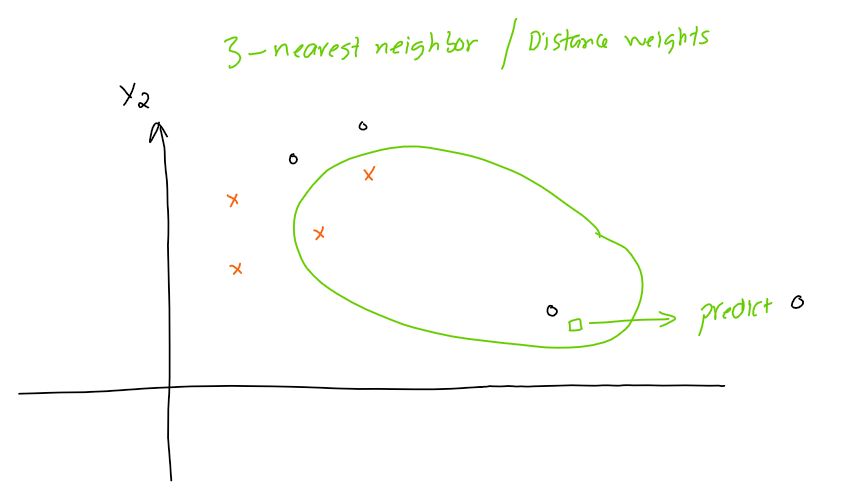

- **Distance Weights:**  The closest neighbor (best friend!) is weighted more than the the two-further-away neighbors, so the weighted vote predicts $o$. 

- $$Weight = \frac{1}{Distance}$$

An Example of Unifom Weights
=======================================================
Use the uniform weights to calculate the predicted probability and the prediction of **3NN** for D. Consider $x$ as 1 and $o$ as 0. 

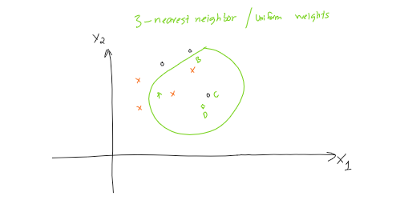

Solution
=======================================================

An Example of Distance Weights
=======================================================
Use the distance weights to calculate the predicted probability and the prediction of **3NN** for D. Consider $x$ as 1 and $o$ as 0.

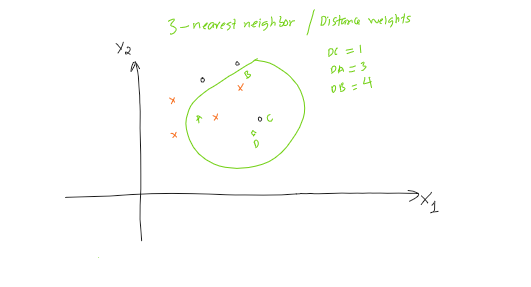

Solution
=======================================================

K-Nearest Neighbor: Properties
=======================================================

- What's nice: Simple and intuitive; easily implementable
- What's NOT nice: 
    - Computationally expensive. 
    - Perform not well in higher dimention data, i.e. data with many columns. 
