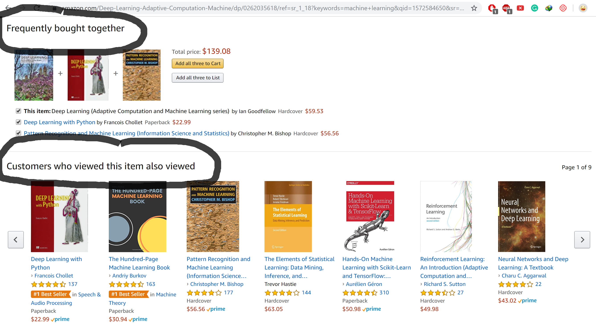
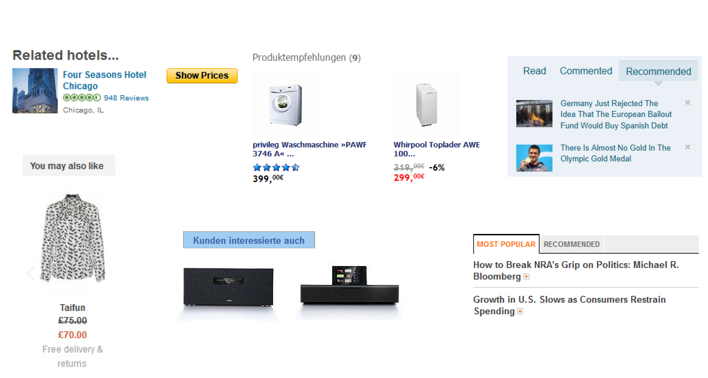
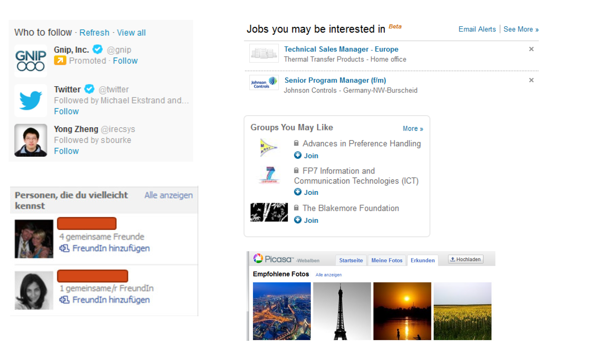
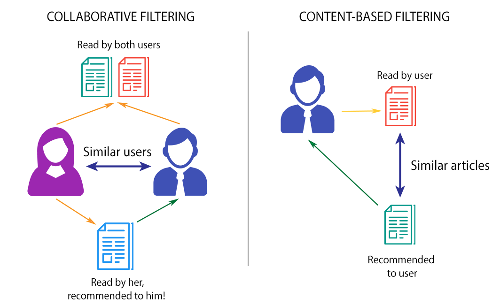
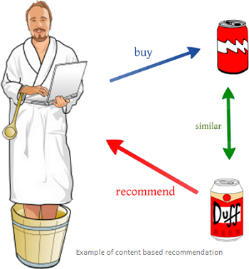
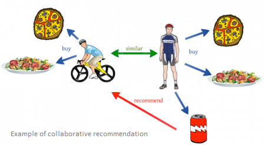
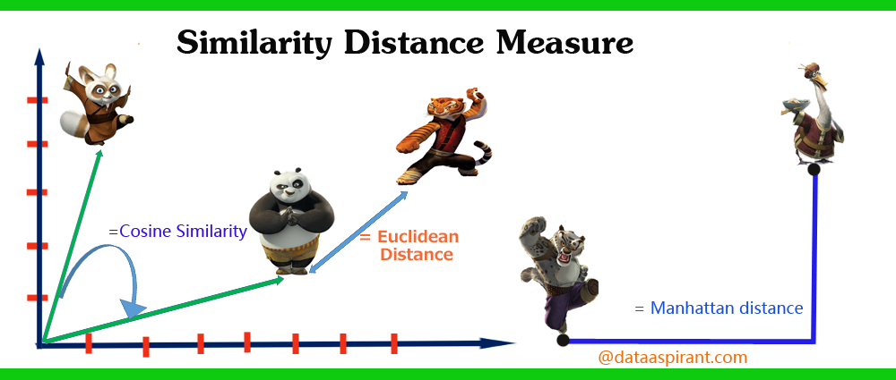
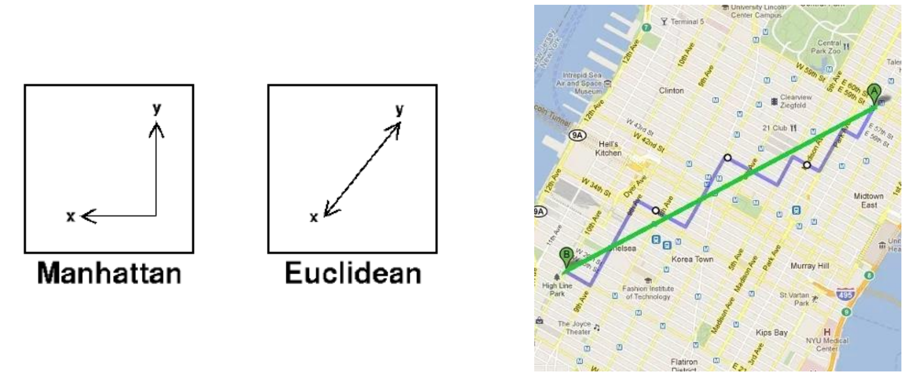

Recommendation Systems
========================================================

Examples - Amazon
=======================================================

Examples - In e-commerce
=======================================================

Examples - In Social Media
=======================================================

Examples - Mobile Apps
=======================================================

Definition - Problem domain
=======================================================
- Recommendation systems (RS) help to match **users** with
**items**

Definition - Problem domain
=======================================================

- RS are one of the **most successful and widespread applications** of machine learning technologies in business.

Two types of systems
=======================================================

Two types of systems
=======================================================

- **Content- Based Filtering**: Recommeding to user A based on his/her existing profiles. 

- **Collaborative Filtering**: Recommeding to user A based on his/her community's profiles. 

Content- Based Filtering
=======================================================

Content- Based Filtering
=======================================================
- Assume there are four categories of news A) Politics B) Sports C) Entertainment D) Technology 

- User A who has read 10 articles related to Technology 

- Recommend a new article in Technology for him to read. 

Collaborative Filtering
=======================================================

Collaborative Filtering
=======================================================

- Assume there are four categories of news A) Politics B) Sports C) Entertainment D) Technology 

- User A who has read 10 articles related to Technology 

- User B who has read **the same** 10 articles related to Technology and an X article in Sports.

- Recommend the article X to user A. 

Collaborative Filtering: Two approaches
=======================================================

Utility Matrix
=======================================================

- Utility Matrix contains ratings of users on items

|       | Item 1| Item 2| Item 3| Item 4|Item 5 |
|:------|------:|------:|------:|------:|:------|
|Alice  |      5|      3|      4|      4|???    |
|User 1 |      3|      1|      2|      3|3      |
|User 2 |      4|      3|      4|      3|5      |
|User 3 |      3|      3|      1|      4|4      |
|User 4 |      1|      5|      5|      2|1      |

- A **recommendation problem** tunrs into a **prediction problem**.

- Predict the rating of the new user on his/her new item.

- If the predicted rating of *Alice* on Item 5 are high (4 or 5), we will recommend Item 5 to her. 

Nearest-neighbors (kNN)
=======================================================

- A "pure" CF approach and traditional baseline
- Using the utility as inputs
- Returns a ranked list of items based on rating predictions

Nearest-neighbors (kNN)
=======================================================

- **Assumptions**
  - If users had similar tastes in the past they will have similar tastes in the
future
  - User preferences remain stable and consistent over time

User-based KNN
=======================================================

|       | Item 1| Item 2| Item 3| Item 4|Item 5 |
|:------|------:|------:|------:|------:|:------|
|Alice  |      5|      3|      4|      4|???    |
|User 1 |      3|      1|      2|      3|3      |
|User 2 |      4|      3|      4|      3|5      |
|User 3 |      3|      3|      1|      4|4      |
|User 4 |      1|      5|      5|      2|1      |

- Find find k nearst neighbors of Alice. 
- User the average rating of the nearest neighbors on Item 5 as a prediction of Alice on Item 5.

User-based KNN
=======================================================

Let $A1$ is the distance from Alice to User 1 and so on.  We have:

A1 = 3.60 

A2 = 1.41 

A3 = 3.60 

A4 = 5

- For 3NN, the predicted rating of Alice for item 5 is the average of ratings on item 5 of her 3 neast neighbors, User 1, 2 and 3. 

- Predicted rating of Alicie on item 5 is: (3+5+4)/3 = 4. 
- We will **recommend** item 5 to Alice. 

Item-based KNN
=======================================================

|       | Item 1| Item 2| Item 3| Item 4|Item 5 |
|:------|------:|------:|------:|------:|:------|
|Alice  |      5|      3|      4|      4|???    |
|User 1 |      3|      1|      2|      3|3      |
|User 2 |      4|      3|      4|      3|5      |
|User 3 |      3|      3|      1|      4|4      |
|User 4 |      1|      5|      5|      2|1      |

- Find the k nearest neighbors of **Item 5**. 
- The predicted rating of Alice on item 5 is the average rating of Alice on the nearest neighbors. 

Item-based KNN
=======================================================

Let $d54$ be the distance of item 5 to item 4 and so on. We have

d54 = 2.23

d53 = 5.19 

d52 = 5 

d51 = 1.41

- For 3NN, the two nearest neighbors of Item 5 are Item 1,4 and Item 2.

- Predicted rating of Alice on Item 5 is the average of her ratings on Item 1, 4 and 2, which is (5+4+3)/3 = 4 
- We **recommend** her to buy Item 5! 

Similarity Measure 
=======================================================
- Neighborhood can be decided by **similarity** measures
- Similarity can be measured as the inverse of the Distance
- The possible similarity values are between 0 and 1, where values near to 1 indicate a strong similarity.
- There are many distance measure
- There are many similarity measure

Similarity Measure 
=======================================================

Manhattan Distance 
=======================================================

Manhattan Distance 
=======================================================

- ManhattanDistance between Alice and User 1 ($A1$). 

|       | Item 1| Item 2| Item 3| Item 4|
|:------|------:|------:|------:|------:|
|Alice  |      5|      3|      4|      4|
|User 1 |      3|      1|      2|      3|

$$A1  = |5-3| + |3-1|+|4-2|+|4-3| = 7$$

Manhattan vs. Euclidean
=======================================================

Cosine Similarity
=======================================================

- **Cosine similarity** is established as the standard in Recommendation System. 

Cosine Similarity Measure 
=======================================================
- Cosine similarity between Alice and User 1 ($S1$). 

|       | Item 1| Item 2| Item 3| Item 4|
|:------|------:|------:|------:|------:|
|Alice  |      5|      3|      4|      4|
|User 1 |      3|      1|      2|      3|

$$S1  = \frac{5 \cdot 3 + 3 \cdot 1 + 4 \cdot 2 + 4 \cdot 3}{\sqrt{5^2+3^2+4^2+4^2}\cdot \sqrt{3^2+1^2+2^2+3^2}} = 0.975$$

The Netflix Challenge
=======================================================

[Link](Netflix_Prize.pptx)
