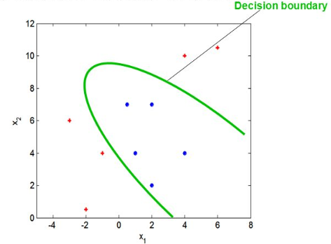
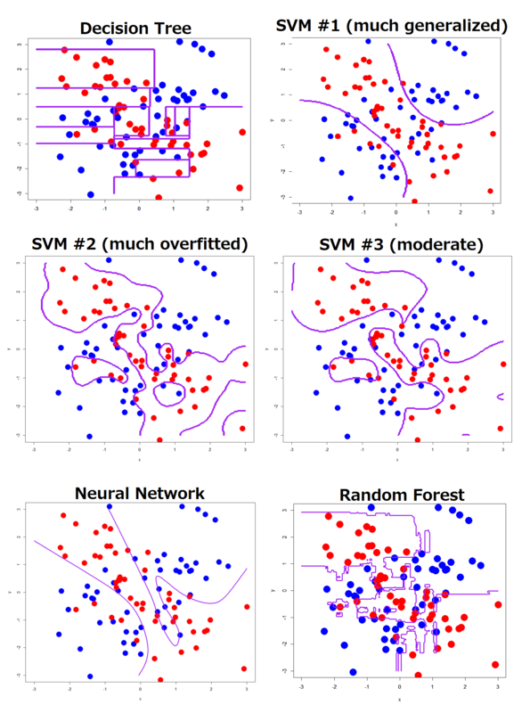
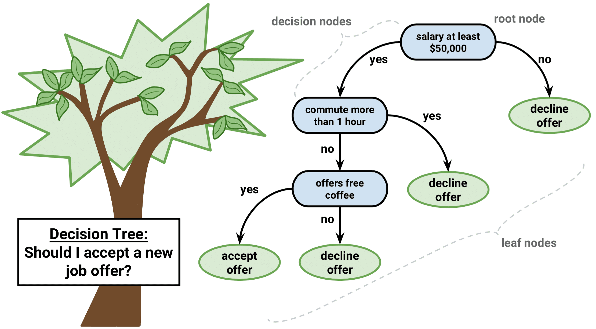
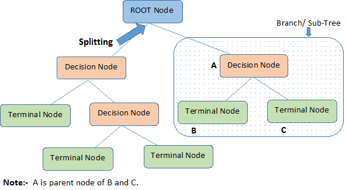

```{r setup, include=FALSE}
options(htmltools.dir.version = FALSE)
```

```{r xaringan-tile-view, echo=FALSE}
xaringanExtra::use_tile_view()
```


```{r xaringan-panelset, echo=FALSE}
xaringanExtra::use_panelset()
```

```{r, echo=FALSE}
xaringanExtra::use_webcam()
```

```{r xaringan-fit-screen, echo=FALSE}
xaringanExtra::use_fit_screen()
```

## Reading Materials

- Max Kuhn. Chapter 14. Section 14.1 


## Decision Boundary in Classification


<center>

</center>

Classification is a process of finding the **decision boundary** that best separate two classes

## Decision Boundary in Classification


<center>

</center>

<center>
SVM = Support Vector Machine
</center>


## Decision Tree

- Decision Tree for classification is **Classification Tree**
- Decision Tree for Regression is **Regression Tree**

## Example of Classification Tree


<center>

</center>

[Link] (http://graphics8.nytimes.com/images/2008/04/16/us/0416-nat-subOBAMA.jpg)

## Example of Classification Tree


<center>

</center>


## Example of Classification Tree


<center>

</center>
